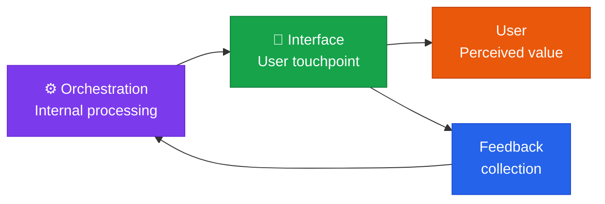

**Human-AI Interaction** — designing the touchpoint where users actually experience and interact with the value of AI.

## Role of this domain

Interface is the **only touchpoint** in the five-domain framework where users directly experience AI. No matter how strong the infrastructure and orchestration underneath it are, AI adoption fails if the user experience is bad.

## Core components

| Component | Description |
|---|---|
| **UI/UX design** | Conversational UI (CUI), multimodal optimization |
| **Multimodal input** | Handling and visualizing images, voice, diagrams, and other input types |
| **AI literacy** | Guidance that helps users make effective use of AI |
| **Feedback loops** | Collecting user feedback and feeding it back into the system |

## Core focus: managing psychological acceptance

Interface is not simply a technical UI problem — it's the domain that manages users' **psychological acceptance** of AI.

- How do users react when the AI is wrong?
- Is there over-reliance on, or under-trust of, AI output?
- Can users control how they collaborate with AI themselves?

## Health check questions

> "Do users understand the limits of AI and use it appropriately?"

- [ ] Does the interface clearly indicate that content is AI-generated?
- [ ] Is user feedback (thumbs up/down) actually connected to system improvement?
- [ ] Does multimodal input reflect users' real needs?
- [ ] Is AI literacy training provided on a regular basis?


  
  
  
  

