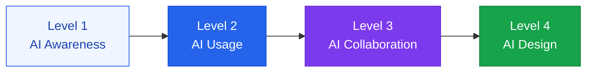

A capability-building program that helps users make effective use of AI while understanding its limitations

## Defining AI literacy levels



| Level | Capability | Audience |
|---|---|---|
| **Level 1** | Knows what AI is | All employees |
| **Level 2** | Uses AI tools at a basic level | All employees |
| **Level 3** | Collaborates with AI to produce results | Key job functions |
| **Level 4** | Designs AI systems | Developers, AI leads |

## Core curriculum content

### For all employees (Levels 1-2)

**Understanding the nature of AI**:
- AI is a probabilistic, pattern-matching system (not 100% accurate)
- Hallucinations can occur, so important information needs to be verified
- AI is a tool that helps users — the final judgment call must be made by a human

**Writing effective prompts**:
- The more specific and clear the instructions, the better the results
- Include role, context, and the desired format
- Providing examples leads to more accurate results

### For developers and AI leads (Levels 3-4)

- Designing and evaluating RAG pipelines
- Advanced prompt engineering
- Criteria for choosing AI models and optimizing cost
- Principles of ethical AI development

## Designing the training program

### Onboarding track

```
Week 1: AI fundamentals + tool introduction (4 hours)
Week 2: Hands-on workshop + Q&A (4 hours)
Week 3: Applying AI to real work (self-directed)
Week 4: Results sharing + feedback (2 hours)
```

### Ongoing learning system

- **Monthly AI newsletter**: latest AI trends and use cases
- **Quarterly workshops**: hands-on practice with new AI tools
- **Internal AI champions**: department-level AI advocates, selected and run per team
- **Results-sharing sessions**: presentations of successful AI use cases

## Example AI usage guidelines

**Recommended uses**:
- Drafting and editing assistance
- Data analysis and summarization
- Idea brainstorming
- Code writing and debugging assistance

**Use with caution**:
- Legal or financial decision-making (must be reviewed by an expert)
- Work involving personal information (mask it before use)
- Content delivered directly to end customers (must be reviewed)
