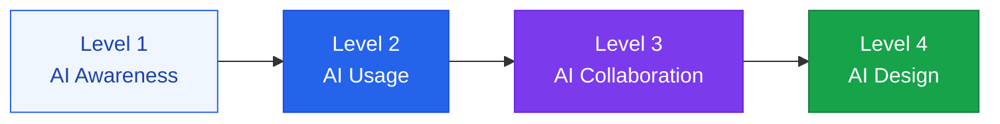

A capability-building program that helps users make effective use of AI while understanding its limitations

## Defining AI literacy levels


```mermaid
flowchart LR
    A["Level 1<br/>AI Awareness"] --> B["Level 2<br/>AI Usage"]
    B --> C["Level 3<br/>AI Collaboration"]
    C --> D["Level 4<br/>AI Design"]

    style A fill:#EFF6FF,stroke:#2563EB,color:#1E40AF
    style B fill:#2563EB,stroke:#1D4ED8,color:#fff
    style C fill:#7C3AED,stroke:#6D28D9,color:#fff
    style D fill:#16A34A,stroke:#15803D,color:#fff
```

| Level | Capability | Audience |
|---|---|---|
| **Level 1** | Knows what AI is | All employees |
| **Level 2** | Uses AI tools at a basic level | All employees |
| **Level 3** | Collaborates with AI to produce results | Key job functions |
| **Level 4** | Designs AI systems | Developers, AI leads |

## Core curriculum content

### For all employees (Levels 1-2)

**Understanding the nature of AI**:
- AI is a probabilistic, pattern-matching system (not 100% accurate)
- Hallucinations can occur, so important information needs to be verified
- AI is a tool that helps users — the final judgment call must be made by a human

**Writing effective prompts**:
- The more specific and clear the instructions, the better the results
- Include role, context, and the desired format
- Providing examples leads to more accurate results

### For developers and AI leads (Levels 3-4)

**Foundations to have in place first**:
- **Python** — the default language of the AI ecosystem: variables, control flow, functions, data structures (lists, dictionaries), file I/O, and installing and using libraries
- **How the models work** — machine learning and neural networks at a conceptual level, and what an LLM is actually doing when it predicts the next token
- **Calling models from code** — moving past the chat window to the API: requesting structured outputs instead of prose, and letting the model call functions (see [Agent Interface](/docs/orchestration/agent-interface))

**Core engineering curriculum**:
- Designing and evaluating RAG pipelines
- Advanced prompt engineering
- Building agents — planning, tool execution, state
- Criteria for choosing AI models and optimizing cost
- Principles of ethical AI development

**Production skills that round out the track**:

| Skill | Why it matters | Reference |
|---|---|---|
| **Version control** | AI-assisted code still needs reviewable history — Git, branches, pull requests | [AI-Native Design Framework](/docs/governance/ai-native) |
| **Cloud deployment** | Pick one of AWS, GCP, or Azure and ship something to it end to end | [Compute Resource Management](/docs/infrastructure/computing) |
| **Vector databases** | The storage layer any real RAG system depends on | [Vector DB Optimization](/docs/infrastructure/vector-db) |
| **Evaluation & testing** | Without measurement, quality regressions ship silently | [AI Model Benchmarking](/docs/infrastructure/ai-model-benchmark) |
| **Security & privacy** | Prompt injection, PII handling, and access control are the engineer's job | [Guardrails & Security](/docs/governance/guardrails) |

### Hands-on practice projects (Levels 3-4)

Reading about these topics is not the same as having built them. Three projects cover the whole skill set, and each one doubles as a portfolio piece:

| Project | What it is | Skills it exercises |
|---|---|---|
| **1. Personal document chatbot** | Upload your own notes or PDFs and answer questions strictly from their contents | Chunking, embedding, retrieval, grounding, citation — the full [RAG pipeline](/docs/orchestration/rag) |
| **2. AI task assistant** | An agent that takes natural-language instructions and performs web search, weather lookups, and to-do management on its own | Tool definitions, [multi-step planning](/docs/orchestration/agent-interface), [state management](/docs/orchestration/state-management), error handling |
| **3. AI features in an existing app** | Add summarization or recommendations to an application you have already built | Integrating AI into real product surfaces, [UI/UX design](/docs/interface/ux-design/), latency and cost trade-offs |

Project 1 teaches retrieval, project 2 teaches autonomy, and project 3 teaches the part that usually decides whether an AI feature survives contact with users — how it fits into something people already use.

## Designing the training program

### Onboarding track

```
Week 1: AI fundamentals + tool introduction (4 hours)
Week 2: Hands-on workshop + Q&A (4 hours)
Week 3: Applying AI to real work (self-directed)
Week 4: Results sharing + feedback (2 hours)
```

### Ongoing learning system

- **Monthly AI newsletter**: latest AI trends and use cases
- **Quarterly workshops**: hands-on practice with new AI tools
- **Internal AI champions**: department-level AI advocates, selected and run per team
- **Results-sharing sessions**: presentations of successful AI use cases

## Example AI usage guidelines

**Recommended uses**:
- Drafting and editing assistance
- Data analysis and summarization
- Idea brainstorming
- Code writing and debugging assistance

**Use with caution**:
- Legal or financial decision-making (must be reviewed by an expert)
- Work involving personal information (mask it before use)
- Content delivered directly to end customers (must be reviewed)
