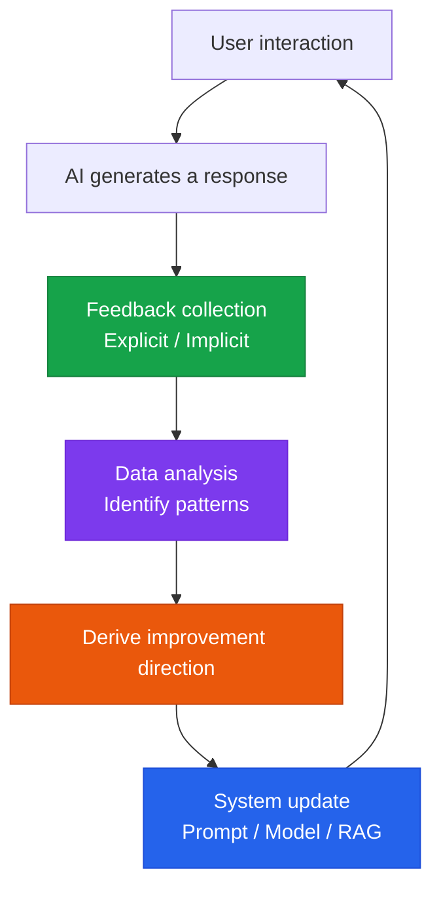

# Feedback Loop

A systematic mechanism for collecting user feedback and feeding it back into AI system improvement

## Structure of the feedback loop



## Types of feedback

### Explicit feedback

Feedback the user provides intentionally:

| Type | UI element | Data collected |
|---|---|---|
| **Binary rating** | 👍 / 👎 buttons | Satisfied / dissatisfied |
| **Star rating** | ⭐⭐⭐⭐⭐ | Satisfaction score |
| **Text feedback** | Comment box | Specific improvement suggestions |
| **Correction submission** | Submit after editing | Corrected-answer data |

### Implicit feedback

Feedback inferred from user behavior:

```
Clicking regenerate       → dissatisfaction with the previous response
Copy/paste                → the response was useful (positive)
Abandoning after stopping → dissatisfaction with the response
Follow-up question        → the response was unclear
```

## RLHF (Reinforcement Learning from Human Feedback)

The process of using collected feedback to improve the model:

```
1. Collect feedback: likes/dislikes + preferred-response selection
   ↓
2. Train a reward model: learn preference patterns
   ↓
3. PPO fine-tuning: update the LLM based on the reward model
   ↓
4. A/B testing: verify the improved model's performance
   ↓
5. Deployment: roll the validated model out to production
```

## Feedback analytics dashboard

Feedback metrics that should be tracked on a regular basis:

| Metric | Description | Frequency |
|---|---|---|
| **Daily satisfaction rate** | Likes / (likes + dislikes) | Daily |
| **Regeneration rate** | Share of responses that trigger a regenerate request | Daily |
| **Feedback topic classification** | Categorizing the reasons behind complaints | Weekly |
| **Before/after comparison** | Change in satisfaction after an update | Post-deployment |

## Implementing a fast improvement loop

```python
# Send an automatic alert when a feedback threshold is exceeded
def check_feedback_threshold(metric: str, value: float):
    thresholds = {
        "satisfaction_rate": 0.80,   # alert if at or below 80%
        "regeneration_rate": 0.20,   # alert if at or above 20%
    }
    if metric in thresholds:
        if value < thresholds[metric]:
            send_alert(f"{metric} threshold not met: {value:.2%}")
```
