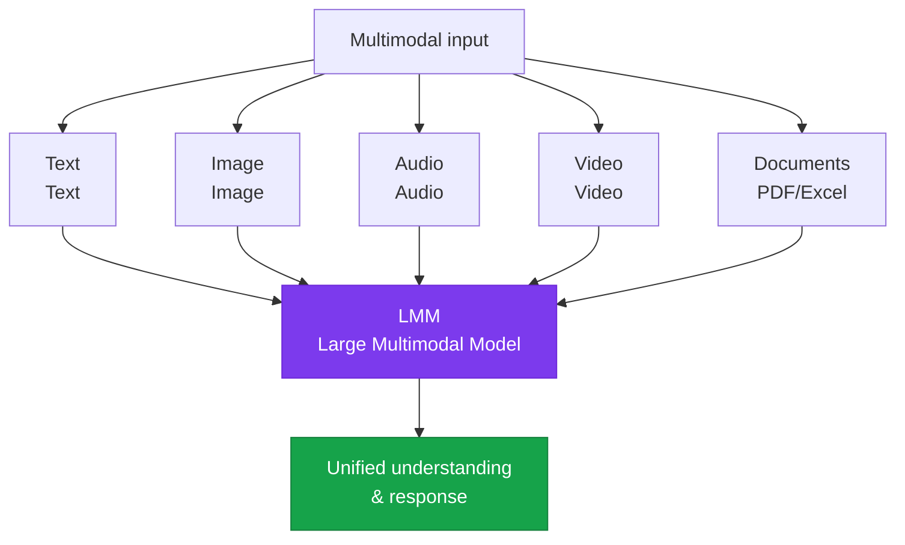

# Multimodal Interface

Designing LMM-based interfaces that leverage diverse input modalities such as images, voice, and diagrams

## The multimodal AI ecosystem



## Major multimodal models (2025)

| Model | Supported modalities | Characteristics |
|---|---|---|
| **Claude 3.5+** | Text, image, PDF | Document understanding, code generation |
| **GPT-4o** | Text, image, audio | Real-time voice conversation |
| **Gemini 2.0** | Text, image, audio, video | Long context, multimedia |
| **Claude 4** | Text, image, PDF | Specialized in long-document analysis |

## Use cases for image input

### Document processing

```python
# Pass a PDF/image document directly to Claude
import anthropic, base64

with open("report.pdf", "rb") as f:
    pdf_data = base64.standard_b64encode(f.read()).decode("utf-8")

response = client.messages.create(
    model="claude-sonnet-4-6",
    max_tokens=2048,
    messages=[{
        "role": "user",
        "content": [
            {
                "type": "document",
                "source": {"type": "base64", "media_type": "application/pdf", "data": pdf_data}
            },
            {"type": "text", "text": "Please summarize the key metrics in this report."}
        ]
    }]
)
```

## Visualization output (Streamlit dashboard)

A representative tool for visualizing AI analysis results:

```python
import streamlit as st
import anthropic

st.title("AI Analysis Dashboard")

uploaded_file = st.file_uploader("Upload a file", type=["pdf", "png", "jpg"])
user_query = st.text_input("Enter what you'd like analyzed")

if uploaded_file and user_query:
    # Request analysis from Claude
    response = analyze_with_claude(uploaded_file, user_query)

    # Visualize the result
    st.markdown(response.content)
    st.download_button("Download result", response.content)
```

## Considerations for voice interface design

- **STT quality**: verify recognition accuracy for Korean-language technical terminology (especially AI-related terms)
- **TTS naturalness**: produce emotionally natural-sounding speech output
- **Response length**: keep voice responses shorter than text (limited listening attention span)
- **Handling interruptions**: preserve the user experience during network latency
