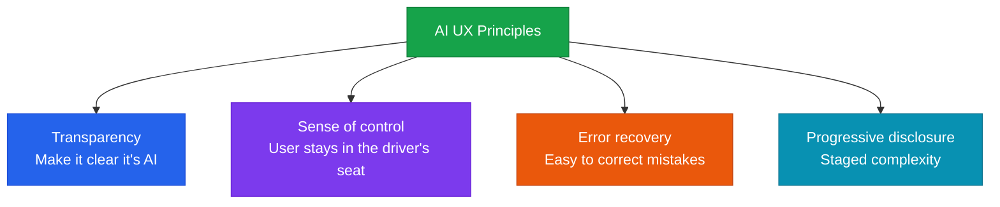

Design principles for conversational user interfaces (CUI) and AI-specific UX patterns

## Core principles of AI UX



## Designing conversational user interfaces (CUI)

### Streaming responses

Use **streaming** so users don't feel like they're waiting around while the AI "thinks."

```python
# Claude API streaming example
with anthropic.messages.stream(
    model="claude-sonnet-4-6",
    max_tokens=1024,
    messages=[{"role": "user", "content": prompt}]
) as stream:
    for text in stream.text_stream:
        print(text, end="", flush=True)
```

### Managing loading states

| State | UX treatment | Example |
|---|---|---|
| **Simple query** (< 3 sec) | Show a spinner | Keyword search |
| **Complex analysis** (3-10 sec) | Show progress messages | "Analyzing..." |
| **Long-running task** (> 10 sec) | Show step-by-step progress | "Step 1/3 complete" |

## AI-specific UX patterns

### 1. Indicating uncertainty

Make it clear to users when the AI isn't confident in its answer.

```
✅ "Based on what I could verify, it's ~. Please check the official site for the latest information."
❌ "It's ~." (stating uncertain information as if it were certain)
```

### 2. Editable AI output

Let users edit or regenerate AI output themselves.

```
[AI-generated text]
  ↓ buttons
[Edit] [Regenerate] [View other version]
```

### 3. Showing sources

In RAG-based systems, show where an answer's information came from.

```
Answer: "Returns are accepted within 30 days of purchase."
Source: [Customer Service Policy v3.2] (click to view the original)
```

## Anti-patterns to avoid

- **AI washing**: dressing up non-AI features as if they were AI
- **Over-anthropomorphization**: portraying AI as human-like in a way that induces excessive trust
- **Forced conversation**: forcing a simple search into a chat interface unnecessarily
- **Opaque AI**: hiding what information the AI based its answer on
