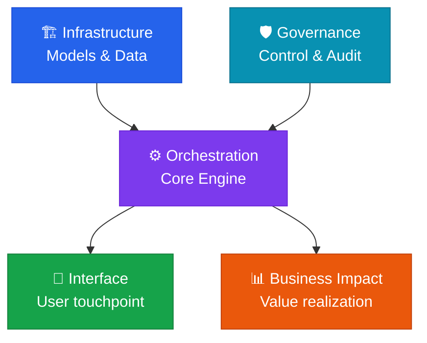

# ⚙️ AI Orchestration

**System Integration & Workflow** — the core engine that combines individual technologies into intelligent workflows.

## Role of this domain

Orchestration is the **core engine** of the five-domain framework. It connects the compute and models that infrastructure provides into workflows that solve real business problems.

## Core components

| Component | Description |
|---|---|
| **Prompt & context design** | Advanced prompting and RAG-based knowledge connection |
| **RAG 2.0** | Verification-focused RAG — GraphRAG, Agentic RAG, CRAG |
| **Agent interfaces** | Integrating external tools (APIs), multi-agent collaboration |
| **State management** | Maintaining continuity of reasoning across agents |
| **Workflow automation** | AI executing complex business logic step by step |

## Core strategy: the agentic environment

The ability to build an **agentic environment** — controlling systems with natural language, as in "vibe coding" — is where this domain is won or lost.

## Health check questions

> "Is our orchestration layer mature enough for agents to collaborate with each other?"

- [ ] Does the RAG pipeline's retrieval accuracy (Recall@K) meet its target?
- [ ] Do agents remember the results of prior steps and move logically to the next one?
- [ ] Does the agent workflow fall back gracefully when an external API fails?
- [ ] Can complex business logic be executed from natural-language instructions alone?


  
  
  
  
  
  
  

