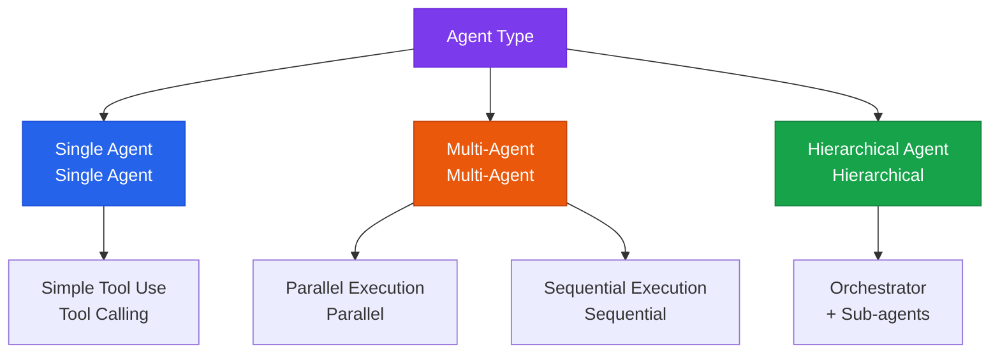

# Agent Interface

Integrating external tools (APIs), multi-agent collaboration, and execution control

## Types of Agent Architectures



## Tool Calling Design Principles

### Good Tool Design

```python
{
  "name": "search_knowledge_base",
  "description": "Searches the company's internal knowledge base for relevant documents. Use it to find policies, procedures, technical documentation, and similar material.",
  "parameters": {
    "query": "The natural-language question to search for",
    "top_k": "Number of documents to return (default: 5)",
    "category": "Search category (optional): hr, technical, policy"
  }
}
```

### Core Principles of Tool Specification
- **Clear naming**: use a verb_noun format (`search_document`, `send_email`)
- **Detailed description**: clearly state when the AI should use this tool
- **Minimal parameters**: only required parameters should be mandatory; make the rest optional

## Multi-Agent Patterns

### Orchestrator–Sub-agent Pattern

```
Orchestrator Agent
├── Research Agent (web search, document search)
├── Analysis Agent (data processing, computation)
├── Coding Agent (writing and executing code)
└── Summary Agent (writing the final report)
```

### Comparing Major Frameworks

| Framework | Characteristics | Best suited for |
|---|---|---|
| **LangGraph** | State-graph-based, complex flow control | Complex workflows |
| **AutoGen** | Conversational multi-agent | Research, collaborative tasks |
| **CrewAI** | Role-based agent teams | Business process automation |
| **Claude Code SDK** | Official Anthropic offering, coding-focused | Development automation |

## Error Handling Strategy

```python
# Exceptions that must always be handled during agent execution
try:
    result = agent.run(task)
except ToolExecutionError as e:
    # Tool execution failed → retry with alternative tools
    result = agent.run(task, fallback_tools=True)
except MaxIterationsError:
    # Prevent infinite loops
    result = "Maximum iteration count exceeded. Please break the task into smaller pieces."
except ContextLengthError:
    # Context exceeded → summarize and retry
    result = agent.run_with_compression(task)
```
