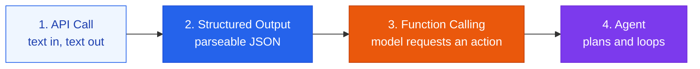
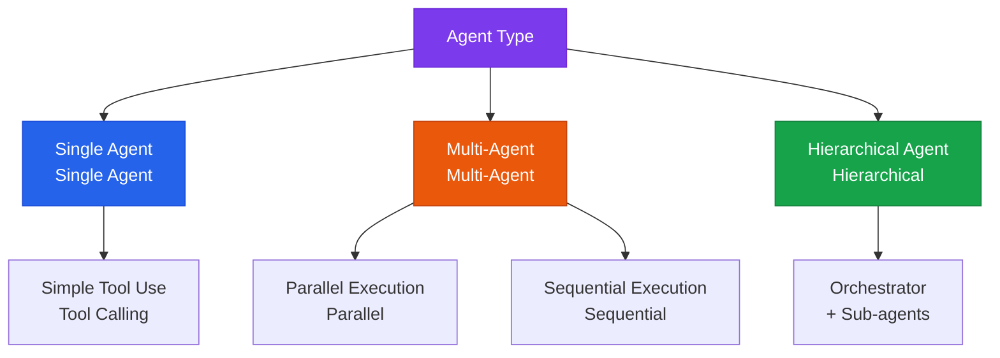

Integrating external tools (APIs), multi-agent collaboration, and execution control

## From API Call to Agent

An agent is not a separate product category — it is what you get after three additions to a plain API call. Each step widens what the model is allowed to do.


```mermaid
flowchart LR
    A["1. API Call<br/>text in, text out"] --> B["2. Structured Output<br/>parseable JSON"]
    B --> C["3. Function Calling<br/>model requests an action"]
    C --> D["4. Agent<br/>plans and loops"]

    style A fill:#EFF6FF,stroke:#2563EB,color:#1E40AF
    style B fill:#2563EB,stroke:#1D4ED8,color:#fff
    style C fill:#EA580C,stroke:#C2410C,color:#fff
    style D fill:#7C3AED,stroke:#6D28D9,color:#fff
```

### Structured Outputs

Prose is fine for a chat window and useless to the calling code. Pin the response to a schema so downstream code can consume it without parsing free text:

```python
# Declare the shape you expect, not the wording
schema = {
    "type": "object",
    "properties": {
        "sentiment": {"type": "string", "enum": ["positive", "neutral", "negative"]},
        "priority": {"type": "integer", "minimum": 1, "maximum": 5},
        "summary":  {"type": "string", "maxLength": 200},
    },
    "required": ["sentiment", "priority", "summary"],
}
```

- **Constrain enums rather than asking for a word** — an `enum` removes the whole class of "Positive!" vs `"positive"` mismatches
- **Validate before you trust** — even schema-constrained output should be validated at the boundary, the same as any external input
- **Keep schemas flat** — deeply nested objects raise the error rate with no gain in usefulness

### Function Calling

Function calling inverts the flow: instead of the model answering, it tells you which action to run and with what arguments. Your code executes it and returns the result, and the model continues from there.

```
User: "How many days of leave do I have left?"
  ↓
Model: → calls get_leave_balance(employee_id="E1042")
  ↓
Your code: executes the function, returns { "remaining": 7.5 }
  ↓
Model: "You have 7.5 days of leave remaining."
```

The model never runs anything itself — it only requests. That boundary is where authorization, rate limiting, and audit logging belong.

## Types of Agent Architectures


```mermaid
flowchart TD
    A["Agent Type"] --> B["Single Agent<br/>Single Agent"]
    A --> C["Multi-Agent<br/>Multi-Agent"]
    A --> D["Hierarchical Agent<br/>Hierarchical"]

    B --> E["Simple Tool Use<br/>Tool Calling"]
    C --> F["Parallel Execution<br/>Parallel"]
    C --> G["Sequential Execution<br/>Sequential"]
    D --> H["Orchestrator<br/>+ Sub-agents"]

    style A fill:#7C3AED,stroke:#6D28D9,color:#fff
    style B fill:#2563EB,stroke:#1D4ED8,color:#fff
    style C fill:#EA580C,stroke:#C2410C,color:#fff
    style D fill:#16A34A,stroke:#15803D,color:#fff
```

## Tool Calling Design Principles

### Good Tool Design

```python
{
  "name": "search_knowledge_base",
  "description": "Searches the company's internal knowledge base for relevant documents. Use it to find policies, procedures, technical documentation, and similar material.",
  "parameters": {
    "query": "The natural-language question to search for",
    "top_k": "Number of documents to return (default: 5)",
    "category": "Search category (optional): hr, technical, policy"
  }
}
```

### Core Principles of Tool Specification
- **Clear naming**: use a verb_noun format (`search_document`, `send_email`)
- **Detailed description**: clearly state when the AI should use this tool
- **Minimal parameters**: only required parameters should be mandatory; make the rest optional

## Multi-Agent Patterns

### Orchestrator–Sub-agent Pattern

```
Orchestrator Agent
├── Research Agent (web search, document search)
├── Analysis Agent (data processing, computation)
├── Coding Agent (writing and executing code)
└── Summary Agent (writing the final report)
```

### Comparing Major Frameworks

| Framework | Characteristics | Best suited for |
|---|---|---|
| **LangGraph** | State-graph-based, complex flow control | Complex workflows |
| **AutoGen** | Conversational multi-agent | Research, collaborative tasks |
| **CrewAI** | Role-based agent teams | Business process automation |
| **Claude Code SDK** | Official Anthropic offering, coding-focused | Development automation |

## Error Handling Strategy

```python
# Exceptions that must always be handled during agent execution
try:
    result = agent.run(task)
except ToolExecutionError as e:
    # Tool execution failed → retry with alternative tools
    result = agent.run(task, fallback_tools=True)
except MaxIterationsError:
    # Prevent infinite loops
    result = "Maximum iteration count exceeded. Please break the task into smaller pieces."
except ContextLengthError:
    # Context exceeded → summarize and retry
    result = agent.run_with_compression(task)
```
