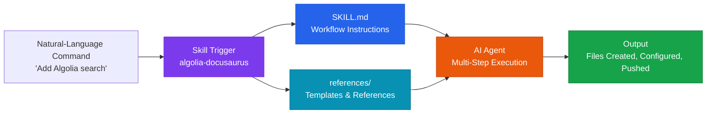

# AI Skill Design

**Skill-Based Orchestration** — a technique for encapsulating repetitive AI workflows into reusable packages

## What Is a Skill?

An AI skill is an orchestration unit that bundles a domain's **procedural knowledge, tool integrations, and reference material** into a single package, letting a single natural-language command trigger a complex, multi-step workflow.



## Why This Is Central to Orchestration

| Component of a skill | Orchestration concept |
|---|---|
| SKILL.md workflow instructions | Prompt & context design |
| references/ domain-knowledge injection | RAG patterns (context injection) |
| Encapsulating per-tool procedures | Agent interfaces (tool integration) |
| Standardized execution flow for repeated tasks | Workflow automation |

Skills are the most practical realization of the **agentic environment that controls a system through natural language** emphasized throughout the Orchestration section.

---

## Structure of a Skill

```
skill-name/
├── SKILL.md              ← Trigger conditions + execution workflow (required)
└── references/           ← Reference material the AI loads as needed
    ├── template.json     ← Reusable template
    └── guide.md           ← Domain-knowledge document
```

### Three-Stage Progressive Disclosure

Skills load only as much as they need, for context efficiency:

```
Stage 1: Metadata (name + description) — always loaded (~100 words)
   ↓ when the skill is triggered
Stage 2: SKILL.md body — workflow instructions are loaded (<5K words)
   ↓ when needed during execution
Stage 3: references/ files — only the specific files needed are loaded
```

---

## Core SKILL.md Design Principles

### Make Trigger Conditions Explicit

```yaml
---
name: algolia-docusaurus
description: |
  This skill should be used when adding Algolia DocSearch
  to a Docusaurus v3 site deployed on GitHub Pages.
  Triggers when the user asks to add search functionality,
  integrate Algolia, or set up DocSearch on a Docusaurus site.
---
```

The `description` field determines when the skill triggers automatically. The more specifically it states **when it should be used**, the more accurately it fires.

### Clearly Separate Automation from Human Involvement

```markdown
## Step 0. Tasks the user must do manually (browser required)
- Create an Algolia account
- Register GitHub Secrets

## Step 1. Tasks Claude automates
- Generate .algolia/config.json
- Modify docusaurus.config.ts
- Create the GitHub Actions workflow
```

Clearly assign tasks that require a browser (logging in, UI operations) to the human, and file creation, modification, and pushing to the AI.

---

## Skill Design Patterns

### Pattern 1: Workflow-Based (Sequential)

Well suited to sequential processes with clearly defined stages.

```
Real example: the algolia-docusaurus skill
Step 0 → Step 1 → Step 2 → Step 3 → Step 4 → Step 5
(precheck) (file creation) (config edits) (workflow) (build verification) (behavior check)
```

### Pattern 2: Reference-Injection-Based (RAG-like)

Use `references/` when there is a large amount of domain knowledge or complex templates involved.

```
SKILL.md: "Read references/crawler-config-template.json,
           substitute GITHUB_USERNAME and REPO_NAME, and generate the file"

→ The AI loads the template at execution time, substitutes variables, and generates the file
→ Saves tokens + reproduces the template accurately
```

### Pattern 3: Guideline-Based (Standard Enforcement)

Used to enforce standards that must be followed, such as coding standards or governance rules:

```
references/adr-standards.md: ADR writing rules
references/code-standards.md: coding conventions
→ The AI must read these before generating code and conform to the standards
```

---

## Skills vs. Traditional Orchestration Techniques

| | Prompt Engineering | RAG | Skills |
|---|---|---|---|
| **Reusability** | Low (written each time) | Medium | High (packaged) |
| **Domain knowledge** | Embedded directly in the prompt | Vector DB search | references/ files |
| **Workflow** | Single response | Single response | Multi-step automation |
| **Team sharing** | Difficult | Requires infrastructure | Instant via file sharing |
| **Maintenance** | Scattered | Requires DB management | File version control |

---

## Practical Application: Building a Skill Library

As a team accumulates skills, AI productivity compounds.

```
team-skills/
├── infra/
│   ├── algolia-search/       ← Search integration
│   └── github-pages-deploy/  ← Deployment automation
├── dev/
│   ├── pr-review/            ← PR review automation
│   └── adr-writer/           ← ADR draft writing
└── docs/
    ├── docusaurus-site/      ← Documentation site generation
    └── api-docs/             ← API documentation
```

When starting a new project, pull the skills you need from the team's skill library and apply them immediately.

## Health Check Question

> "Are there repetitive tasks on our team that could be packaged as skills?"

- [ ] Are there tasks where we repeat a similar setup every time?
- [ ] Are there tasks where we explain the same context to the AI every time?
- [ ] Are there complex procedures that a new team member would struggle to perform alone?
- [ ] Are there areas where the AI should always be forced to follow a shared team standard?
