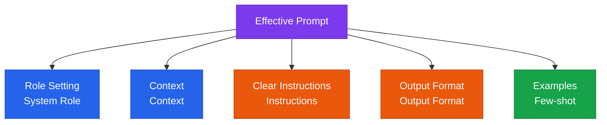

Advanced prompt engineering and effective context construction strategies

## Principles of Prompt Structuring



## Prompt Pattern Library

### 1. Chain-of-Thought (CoT)

Well suited to tasks that require complex reasoning.

```
Think step by step:
1. Analyze the problem
2. Examine each element
3. Draw a conclusion
```

### 2. Few-shot Prompting

Provide examples when a consistent output format is required.

```
Input: [Example input 1]
Output: [Example output 1]

Input: [Example input 2]
Output: [Example output 2]

Input: [Actual input]
Output:
```

### 3. ReAct (Reason + Act)

A pattern in which the agent alternates between reasoning and acting.

```
Thought: [Analyze the current situation]
Action: [Tool/action to perform]
Observation: [Check the result]
Thought: [Plan the next step]
...
Final Answer: [Conclusion]
```

## Context Window Management

| Strategy | Description | Best suited for |
|---|---|---|
| **Sliding window** | Automatically drop older messages | Long conversation sessions |
| **Summary compression** | Compress past conversation into a summary | When conversation history must be retained |
| **RAG injection** | Inject only the information needed | Leveraging domain knowledge |
| **Prompt caching** | Reuse cached context for repeated content | Cost optimization |

## Prompt Version Control

Prompts need version control just like code:

```
prompts/
├── v1.0.0/
│   ├── system.txt
│   └── user_template.txt
├── v1.1.0/
│   ├── system.txt
│   └── user_template.txt
└── production -> v1.1.0/  (symbolic link)
```
