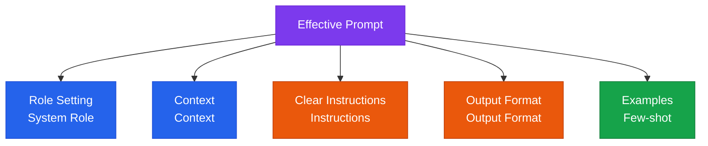

Advanced prompt engineering and effective context construction strategies

## Principles of Prompt Structuring


```mermaid
flowchart TD
    A["Effective Prompt"] --> B["Role Setting<br/>System Role"]
    A --> C["Context<br/>Context"]
    A --> D["Clear Instructions<br/>Instructions"]
    A --> E["Output Format<br/>Output Format"]
    A --> F["Examples<br/>Few-shot"]

    style A fill:#7C3AED,stroke:#6D28D9,color:#fff
    style B fill:#2563EB,stroke:#1D4ED8,color:#fff
    style C fill:#2563EB,stroke:#1D4ED8,color:#fff
    style D fill:#EA580C,stroke:#C2410C,color:#fff
    style E fill:#EA580C,stroke:#C2410C,color:#fff
    style F fill:#16A34A,stroke:#15803D,color:#fff
```

## Prompt Pattern Library

### 1. Chain-of-Thought (CoT)

Well suited to tasks that require complex reasoning.

```
Think step by step:
1. Analyze the problem
2. Examine each element
3. Draw a conclusion
```

### 2. Few-shot Prompting

Provide examples when a consistent output format is required.

```
Input: [Example input 1]
Output: [Example output 1]

Input: [Example input 2]
Output: [Example output 2]

Input: [Actual input]
Output:
```

### 3. ReAct (Reason + Act)

A pattern in which the agent alternates between reasoning and acting.

```
Thought: [Analyze the current situation]
Action: [Tool/action to perform]
Observation: [Check the result]
Thought: [Plan the next step]
...
Final Answer: [Conclusion]
```

## Context Window Management

| Strategy | Description | Best suited for |
|---|---|---|
| **Sliding window** | Automatically drop older messages | Long conversation sessions |
| **Summary compression** | Compress past conversation into a summary | When conversation history must be retained |
| **RAG injection** | Inject only the information needed | Leveraging domain knowledge |
| **Prompt caching** | Reuse cached context for repeated content | Cost optimization |

## Prompt Evaluation

A prompt change that looks better on the one example you tried is not an improvement — it is an anecdote. Version control below is only useful if each version has a number attached to it:

- **Keep a fixed test set** — 20–50 real inputs with known-good outputs, including the cases that previously failed
- **Score automatically where you can** — exact match or schema validity for structured output, retrieval metrics for RAG-backed answers
- **Use an LLM judge for the rest** — a separate model scoring against an explicit rubric, spot-checked by a human, not trusted blindly
- **Compare against the current production prompt, not against nothing** — the question is always "better than what we ship today?"
- **Watch for regressions** — a prompt tuned for one case commonly breaks another, which is exactly what the fixed test set catches

### Evaluation Tooling

Tools differ mainly in whether they are built around *running experiments* or around *observing production*. Most teams end up with one of each:

| Tool | Shape | Best fit |
|---|---|---|
| **Promptfoo** | Open-source CLI, config-driven | Comparing prompts and models side by side in CI, without adopting a platform |
| **DeepEval** | Open-source, pytest-style assertions | Treating prompt regressions as failing unit tests in an existing test suite |
| **Ragas** | Open-source, RAG-specific metrics | Scoring faithfulness and context quality — see [RAG evaluation metrics](/docs/orchestration/rag/) |
| **Langfuse** | Open-source, self-hostable tracing + datasets | Keeping traces and eval data inside your own infrastructure |
| **LangSmith** | Hosted tracing, datasets, evaluators | Teams already on LangChain or LangGraph |
| **Braintrust** | Hosted, experiment-first | Comparing many prompt versions against a scored dataset over time |
| **Arize Phoenix** | Open-source, OpenTelemetry-based | Unifying LLM traces with the rest of your [observability](/docs/governance/monitoring/) stack |

Two cautions. Pick the tool after you have a test set, not before — a platform with nothing to score is overhead. And LLM-judge scores are model outputs like any other: they drift when the judge model changes, so pin the judge version and re-check a sample by hand.

## Prompt Version Control

Prompts need version control just like code:

```
prompts/
├── v1.0.0/
│   ├── system.txt
│   └── user_template.txt
├── v1.1.0/
│   ├── system.txt
│   └── user_template.txt
└── production -> v1.1.0/  (symbolic link)
```
