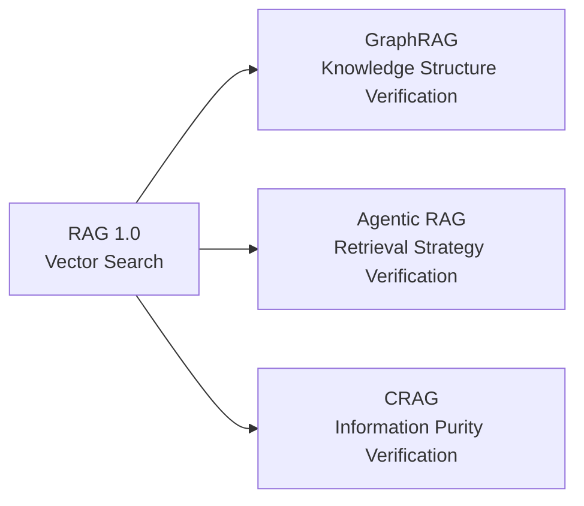
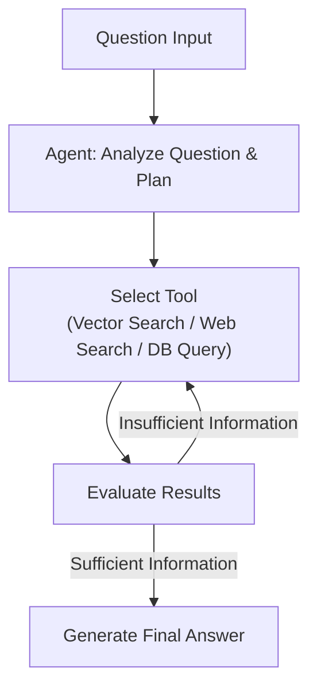
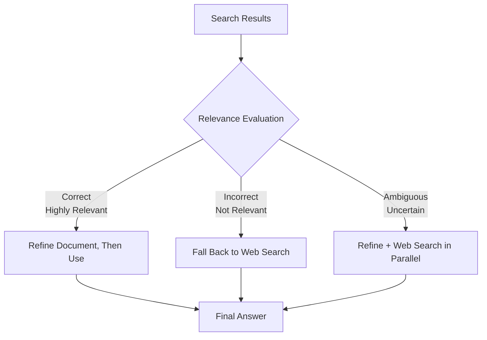

> Source: [RAG 2.0 기술 총정리](https://blog.cslee.co.kr/rag-2-0-graphrag-agentic-rag-crag/) — from concepts to practical application

While RAG 1.0 focused on retrieval, **RAG 2.0 focuses on verification.** Three distinct approaches each tackle the verification problem in their own way.

---

## Limitations of Traditional RAG (Naive RAG)

Classic RAG is a three-stage pipeline: document indexing → vector similarity search → LLM generation.

| Limitation | Description |
|---|---|
| **Retrieval quality** | Vector similarity alone cannot judge true contextual relevance |
| **Global questions** | Cannot answer questions like "What are the main themes in this dataset?" |
| **Connecting relationships** | Struggles with complex questions that require linking multiple documents |
| **No self-verification** | Cannot judge on its own whether the retrieved documents are actually relevant |

---

## The Three Approaches of RAG 2.0

---

## 1. GraphRAG — Knowledge-Graph-Based Retrieval

Announced and open-sourced by Microsoft in 2024, this approach indexes documents as a **knowledge graph** rather than as vectors.

### Indexing Stage

1. Split documents into TextUnits
2. Use an LLM to extract **entities**, **relationships**, and **claims**
3. Structure the knowledge graph
4. Cluster **communities** (tightly connected groups of entities) using graph algorithms
5. Generate an LLM summary for each community

### Query Stage — Two Retrieval Methods

| Method | Target questions | Example |
|---|---|---|
| **Local search** | Related to a specific entity | "What projects relate to policy issues commissioned by the City of Seoul?" |
| **Global search** | Related to the entire dataset | "What are the main trends across our department's bidding projects?" |

### Performance and Practical Considerations

- **Comprehensiveness**: 70-80% win rate over traditional RAG (Microsoft benchmark)
- **High indexing cost**: the LLM is called multiple times over every document — watch API costs
- **Domain tuning required**: entity/relationship extraction prompts need to be tuned per domain
- **GraphRAG 1.0** (Dec 2024): integrates vector stores such as LanceDB and Azure AI Search

---

## 2. Agentic RAG — Dynamically Reasoning Retrieval

Integrates an AI agent into the RAG pipeline to **dynamically formulate and execute a retrieval strategy**.

### ReAct Framework Flow

### Practical Example — Reviewing a New Bidding Project

1. **Vector DB search** → finds 5 similar past projects
2. **Graph search** → checks competitors' contract-award status
3. **Automatic judgment** → "Competitor A has won 2 City of Seoul projects; strategy needs to be reconsidered"

### Key Characteristics

- **Multiple data sources**: chooses among vector DB, RDB, web search, and APIs as needed
- **Query routing**: automatically connects to the appropriate search engine based on question type
- **Multi-turn**: gathers information incrementally through multiple rounds of interaction

### Implementation Tools

| Tool | Characteristics |
|---|---|
| **LangGraph** | State-graph-based workflow, integrates with LangChain |
| **LlamaIndex** | Built-in agentic document workflows |
| **AutoGen** | Microsoft's multi-agent framework |
| **CrewAI** | Collaborative agent-team system |

---

## 3. CRAG — Self-Verifying Retrieval

Published on arXiv in January 2024. A mechanism that **evaluates and corrects** the quality of retrieved documents on its own.

### Three Core Components

#### ① Retrieval Evaluator

Assigns a relevance score to each retrieved document and chooses one of three paths.

#### ② Knowledge Refinement

- Decompose documents into "knowledge strips"
- Re-evaluate the relevance of each fragment
- Select only the core information

#### ③ Web Search Expansion

- Perform web search after query rewriting
- Prioritize trustworthy sources such as Wikipedia

### The Strength of CRAG — Modularity

Because it only requires **adding an evaluator layer** to an existing RAG pipeline, it can be adopted incrementally. It is the most practical entry point into RAG 2.0, requiring no full rebuild.

---

## Comparing the Three Techniques

| | **GraphRAG** | **Agentic RAG** | **CRAG** |
|---|---|---|---|
| **Core innovation** | Structuring knowledge as a graph | Dynamic agent | Self-verification |
| **What it verifies** | The structure of knowledge | The appropriateness of retrieval | The purity of information |
| **Strength** | Complex relationships, global questions | Flexible, multi-source | Simple, modular |
| **Weakness** | High cost, slow indexing | Complexity, hard to debug | Depends on evaluator accuracy |
| **Adoption difficulty** | High | Medium-high | Low |

---

## Remaining Challenges

- **Cost**: better quality means more LLM calls — a tradeoff between API cost and response latency
- **Explainability**: the more complex the pipeline, the harder it is to trace "why this answer came out"
- **Evaluation criteria**: the definition of a "good answer" varies by domain
- **Domain specialization**: there is no universal configuration — tuning is always required

---

## Future Directions

- **LazyGraphRAG**: lightweight graph construction at reduced cost
- **Multimodal RAG**: unified processing of text, images, tables, and charts
- **Agent collaboration**: multiple specialized agents dividing responsibilities
- **Explainability**(XAI): systems that can trace the answer-generation process

---

## Related Categories

- [🏗 Infrastructure & Architecture](../infrastructure) — choosing vector DBs and LLM API providers
- [🛡 AI Governance](../governance) — hallucination monitoring, answer trustworthiness management
