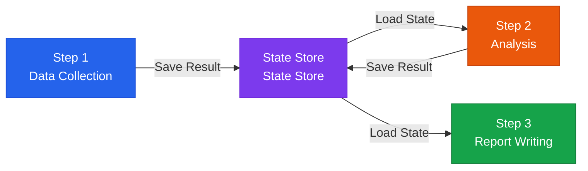

# State Management

Strategies for maintaining continuity of reasoning across complex agent workflows

## Why State Management Matters

In complex workflows, the key is managing the **continuity of reasoning** — having the AI remember prior steps and logically move on to the next one.



## Types of State

| State type | Duration | Storage | Example use |
|---|---|---|---|
| **In-memory state** | During execution | Python dict | A single execution session |
| **Session state** | For the conversation | Redis | Multi-turn conversation |
| **Persistent state** | Long-term | PostgreSQL | User preferences, history |
| **Checkpoint** | Until the task completes | File/DB | Long-running workflows |

## LangGraph State Management Example

```python
from langgraph.graph import StateGraph
from typing import TypedDict, List

class AgentState(TypedDict):
    messages: List[str]
    current_step: str
    collected_data: dict
    analysis_result: str
    is_complete: bool

def research_node(state: AgentState) -> AgentState:
    # Read the previous state and return a new state
    data = collect_data(state["messages"][-1])
    return {
        **state,
        "collected_data": data,
        "current_step": "analysis"
    }

graph = StateGraph(AgentState)
graph.add_node("research", research_node)
graph.add_node("analysis", analysis_node)
graph.add_node("report", report_node)
```

## Checkpointing Strategy

So that a long-running workflow doesn't have to restart from scratch after a mid-run failure:

```python
# Save a checkpoint after each step completes
checkpoint = {
    "step": "data_collection",
    "status": "completed",
    "result": collected_data,
    "timestamp": datetime.now().isoformat()
}
db.save_checkpoint(workflow_id, checkpoint)

# On restart, resume from the last checkpoint
last_checkpoint = db.load_checkpoint(workflow_id)
if last_checkpoint["step"] == "data_collection":
    skip_to_analysis(last_checkpoint["result"])
```
