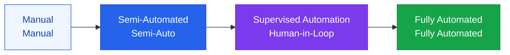

# Workflow Automation

A workflow engine where AI carries out complex business logic step by step

## Defining Levels of Automation



## The Human-in-the-Loop Pattern

Not every automated process needs to be fully autonomous. Placing **human review at the right points** is what makes a system safe and trustworthy.

```
AI Drafts → [Automated Quality Check] → Human Review → AI Final Revision → Publish
                                            ↑
                              Human intervenes at this point
```

**Cases requiring human intervention**:
- Decisions with significant legal or financial impact
- Situations with high uncertainty (AI confidence below a threshold)
- Handling sensitive personal information
- External communications carrying brand risk

## Examples of Business Workflow Automation

### Customer Support Automation

```
Customer Inquiry Received
  → Intent Classification (AI)
  → FAQ Search (RAG)
  → Answer Generation (LLM)
  → Sentiment Analysis (AI): escalate to a human agent if negative
  → Send Answer
  → Satisfaction Survey
```

### Content Generation Automation

```
Topic Input
  → Research Agent (web search + internal DB)
  → Outline Generation (LLM)
  → Draft Writing (LLM)
  → Fact Checking (search + verification)
  → Editor Review [Human checkpoint]
  → SEO Optimization (AI)
  → Publish
```

## Workflow Monitoring

Automated workflows must always be monitored:

| Metric | Description | Alert threshold |
|---|---|---|
| **Success rate** | Proportion of workflows completed | < 95% |
| **Average duration** | Time taken to complete a workflow | More than 2x the baseline |
| **Escalation rate** | Proportion of runs requiring human intervention | > 20% |
| **Cost per run** | LLM cost per workflow execution | Exceeds budget |
