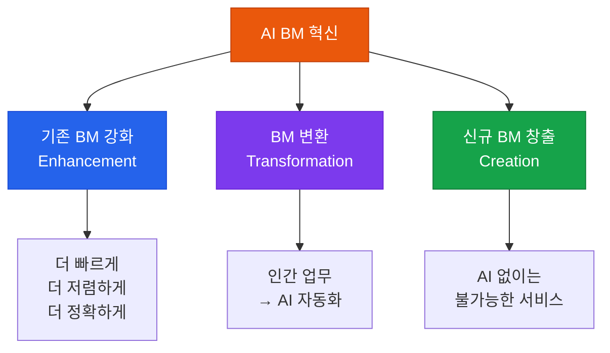

# BM(비즈니스 모델) 혁신

AI를 통한 새로운 제품·서비스 개발 및 시장 진입 전략

## AI가 가능하게 하는 BM 혁신 유형



## AI BM 혁신 사례

### 기존 BM 강화 (Enhancement)

| 산업 | 기존 BM | AI 강화 후 |
|---|---|---|
| **법률** | 변호사가 계약서 검토 | AI 1차 검토 → 변호사 최종 확인 (10배 빠름) |
| **의료** | 의사가 영상 판독 | AI 보조 판독 (정확도 향상, 의사 집중력 확보) |
| **교육** | 강사 일대다 수업 | AI 개인 튜터 + 강사 그룹 심화 |

### 신규 BM 창출 (Creation)

**AI First 서비스**:

```
예시: AI 기반 개인화 학습 플랫폼
  - 기존: 동일한 커리큘럼 → 모든 학생
  - AI 후: 학생별 약점 분석 → 맞춤 문제 생성 → 실시간 피드백
  - 결과: 학습 효율 3배, 완료율 2배

예시: AI 법률 자문 구독 서비스
  - 기존: 변호사 시간당 수십만원
  - AI 후: 월 5만원 구독 → 24시간 기본 법률 질의응답
  - 결과: 중소기업 법률 접근성 획기적 향상
```

## AI BM 혁신 평가 매트릭스

새로운 AI BM 아이디어를 평가할 때:

| 평가 기준 | 질문 | 점수 (1-5) |
|---|---|---|
| **시장 크기** | 타겟 시장이 충분히 큰가? | |
| **AI 차별성** | AI 없이는 불가능한 서비스인가? | |
| **기술 실현성** | 현재 기술로 구현 가능한가? | |
| **수익성** | 지속 가능한 Unit Economics인가? | |
| **진입 장벽** | 경쟁자가 따라오기 어려운가? | |

## AI 비즈니스 모델 캔버스

기존 Business Model Canvas에 AI 관점 추가:

```
[AI BM 추가 질문]

가치 제안:  AI로 인해 새롭게 제공 가능해진 가치는?
핵심 활동:  AI가 대체하거나 강화하는 활동은?
비용 구조:  LLM API, 인프라 등 AI 특화 비용은?
수익 흐름:  AI 기능에 대한 추가 과금 가능한가?
핵심 자원:  독점적 데이터, 학습된 모델이 있는가?
```
