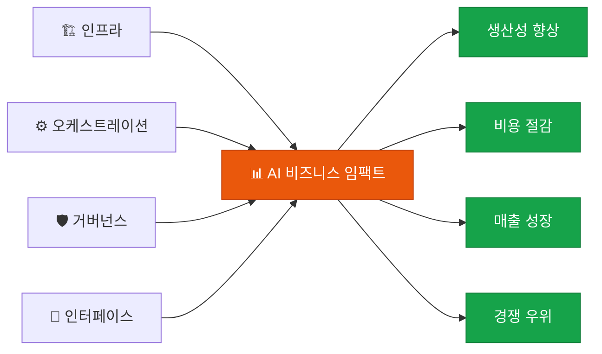

# 📊 AI 비즈니스 임팩트

**Value & ROI** — AI 도입이 실제 비즈니스 가치로 전환되는지 정량적으로 평가

## 이 영역의 역할

AI 비즈니스 임팩트는 5개 영역 프레임워크의 **최종 가치 실현** 단계입니다. 모든 AI 투자는 결국 이 영역에서 정당화됩니다.

## 핵심 구성 요소

| 구성 요소 | 설명 |
|---|---|
| **KPI & ROI 분석** | 생산성 향상, 비용 절감, 매출 기여도 측정 |
| **Time-to-Market** | AI 기술을 실제 서비스에 적용하는 속도 |
| **BM 혁신** | AI를 통한 새로운 제품·서비스·시장 전략 |
| **스케일업** | 성공적인 유즈케이스를 전사적으로 확산 |

## 핵심 평가 관점

AI 도입이 단순 비용 절감을 넘어 **'일하는 방식의 근본적 혁신'**으로 이어지는지 평가해야 합니다.

- **효율화**: 기존 업무를 더 빠르게
- **자동화**: 기존 업무를 AI가 대체
- **혁신**: AI로만 가능한 새로운 업무 창출

## Health Check 질문

> "AI 도입이 단순 비용 절감을 넘어 새로운 가치를 창출하고 있는가?"

- [ ] AI 프로젝트별 ROI가 측정되고 있는가?
- [ ] 새로운 AI 기술을 적용하는 Time-to-Market이 단축되고 있는가?
- [ ] AI로만 가능한 신규 비즈니스 모델을 탐색하고 있는가?
- [ ] 성공적인 유즈케이스가 다른 팀/부서로 확산되고 있는가?
