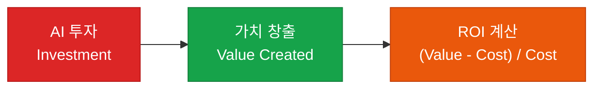

# KPI & ROI 분석

AI 도입 효과를 정량적으로 측정하는 지표 체계

## AI ROI 계산 프레임워크



**ROI = (AI로 창출된 가치 - AI 총 비용) / AI 총 비용 × 100%**

## 가치 측정 유형

### 정량적 측정 (직접 측정 가능)

| 가치 유형 | 측정 지표 | 예시 |
|---|---|---|
| **시간 절감** | 작업 처리 시간 감소율 | 보고서 작성 4시간 → 30분 |
| **비용 절감** | 인건비, 외주비 감소 | 월 200만원 → 50만원 |
| **오류 감소** | 에러율, 재작업 빈도 | 오탈자율 5% → 0.5% |
| **처리량 증가** | 동일 인원 처리 건수 | 1인 50건 → 200건/일 |

### 정성적 측정 (간접 효과)

| 가치 유형 | 측정 방법 |
|---|---|
| **직원 만족도** | 분기별 설문 |
| **의사결정 품질** | 결정 후 6개월 성과 추적 |
| **혁신 속도** | 신규 아이디어 → 실행까지 기간 |
| **고객 만족도** | NPS, CSAT 변화 |

## AI 프로젝트 ROI 계산 예시

### 케이스: 고객 지원 AI 챗봇

```
[비용]
  LLM API 비용:     월 200만원
  개발/운영 인건비:  월 300만원
  인프라 비용:      월 50만원
  총 비용:         월 550만원

[가치]
  상담원 처리 건수 감소: 월 2,000건
  상담원 인건비 절감:   월 1,600만원 (2,000건 × 8,000원/건)
  24시간 서비스:       고객 만족도 NPS +15점
  총 가치:            월 1,600만원+

[ROI]
  월 순이익: 1,600 - 550 = 1,050만원
  ROI:     1,050 / 550 = 191%
  투자 회수 기간: 약 1개월
```

## KPI 대시보드 구성

```
[월간 AI 성과 대시보드]

📈 생산성
  · 직원 1인당 처리량: 전월 대비 +23%
  · 평균 작업 완료 시간: 4.2h → 1.8h

💰 비용
  · AI 총 투자 비용: 850만원
  · 비용 절감 효과: 2,100만원
  · 순 ROI: 147%

🎯 품질
  · 오류율: 3.2% → 0.8%
  · 고객 만족도(CSAT): 78 → 86

⚡ 속도
  · 새 기능 Time-to-Market: 6주 → 3주
```
