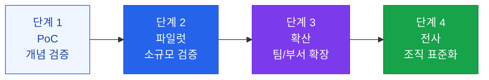

# 스케일업 전략

성공적인 AI 유즈케이스를 전사적으로 확산하는 체계적 전략

## AI 스케일업 단계



## 각 단계별 핵심 활동

### 단계 1: PoC (1~4주)
- 목표: "이것이 기술적으로 가능한가?"
- 팀 구성: AI 개발자 1~2명
- 성공 기준: 기술적 타당성 확인
- 산출물: 데모, 기술 검토 보고서

### 단계 2: 파일럿 (1~3개월)
- 목표: "실제 사용자에게 가치가 있는가?"
- 팀 구성: AI 개발자 + 도메인 전문가 + 사용자 그룹
- 성공 기준: 측정 가능한 KPI 달성
- 산출물: ROI 분석, 사용자 피드백, 개선 사항

### 단계 3: 확산 (3~6개월)
- 목표: "다른 팀에도 적용 가능한가?"
- 팀 구성: AI 팀 + 비즈니스 팀들
- 성공 기준: 복수 팀의 성공적 도입
- 산출물: 표준화된 플레이북, 내부 교육 자료

### 단계 4: 전사 표준화 (6~12개월)
- 목표: "조직의 일하는 방식으로 정착했는가?"
- 팀 구성: AI CoE (Center of Excellence)
- 성공 기준: 전 직원의 일상적 활용
- 산출물: AI 거버넌스 정책, 지속 운영 체계

## AI Center of Excellence (CoE) 구성

전사 AI 스케일업을 위한 조직 구조:

```
AI CoE
├── AI 전략 (Chief AI Officer)
│   └── AI 로드맵, 거버넌스 정책
├── AI 엔지니어링
│   └── 공통 인프라, MLOps, 보안
├── AI 제품
│   └── 내부 AI 도구, 플랫폼
└── AI 역량 강화
    └── 교육, 커뮤니티, AI 챔피언
```

## 스케일업 저항 극복

| 저항 유형 | 원인 | 대응 전략 |
|---|---|---|
| **기술 불신** | "AI가 틀릴 수 있다" | 실제 정확도 데이터 공유, 단계적 신뢰 구축 |
| **직업 불안** | "AI가 내 일을 대체한다" | AI = 도구 교육, 업무 전환 지원 |
| **변화 거부** | "기존 방식이 더 낫다" | 얼리 어답터 성공 사례 공유 |
| **기술 장벽** | "사용이 너무 어렵다" | UX 개선, 충분한 교육 제공 |
