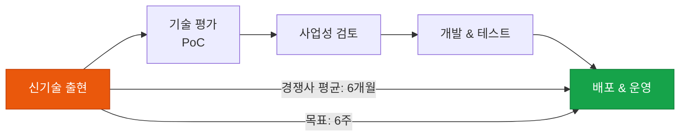

# Time-to-Market

새로운 AI 기술을 실제 서비스에 적용하는 속도 — 그 자체가 강력한 경쟁력

## 왜 Time-to-Market이 중요한가

AI 기술은 빠르게 진화합니다. 새로운 모델이나 기법이 등장했을 때 이를 실제 서비스에 **적용하는 속도** 자체가 강력한 비즈니스 경쟁력이 됩니다.



## Time-to-Market 단축 전략

### 1. AI 실험 플랫폼 구축

표준화된 실험 환경으로 PoC 속도를 높입니다:

```
AI 실험 플랫폼 구성 요소:
  ✅ 모델 레지스트리 (사용 가능한 모델 카탈로그)
  ✅ 프롬프트 실험 노트북 (Jupyter + LangSmith)
  ✅ 데이터 커넥터 (표준화된 데이터 접근)
  ✅ 빠른 배포 파이프라인 (CI/CD for AI)
  ✅ A/B 테스트 프레임워크
```

### 2. 모듈화된 AI 컴포넌트

재사용 가능한 AI 컴포넌트를 라이브러리화합니다:

```
ai-components/
├── retrievers/       # RAG 검색기 모음
├── evaluators/       # 품질 평가 모음
├── guardrails/       # 가드레일 모음
├── formatters/       # 출력 형식 변환기
└── connectors/       # 외부 시스템 연결기
```

### 3. "Fast Lane" 실험 프로세스

신기술 검증을 위한 가속 프로세스:

| 단계 | 기간 | 목표 |
|---|---|---|
| **기술 파악** | 1일 | 핵심 기능 이해, 비용 추정 |
| **PoC 개발** | 1주 | 핵심 기능 동작 확인 |
| **내부 테스트** | 1주 | 품질·성능·비용 검증 |
| **파일럿 배포** | 2주 | 제한된 사용자 대상 검증 |
| **전체 배포** | 2주 | 점진적 롤아웃 |

총 **6주 이내** 신기술 적용 완료가 목표.

## Time-to-Market KPI

| 지표 | 측정 방법 | 목표 |
|---|---|---|
| **기술 인지→PoC 완료** | 날짜 차이 | < 1주 |
| **PoC→파일럿 배포** | 날짜 차이 | < 3주 |
| **파일럿→전체 배포** | 날짜 차이 | < 4주 |
| **전체 T2M** | 인지→전체 배포 | < 8주 |
