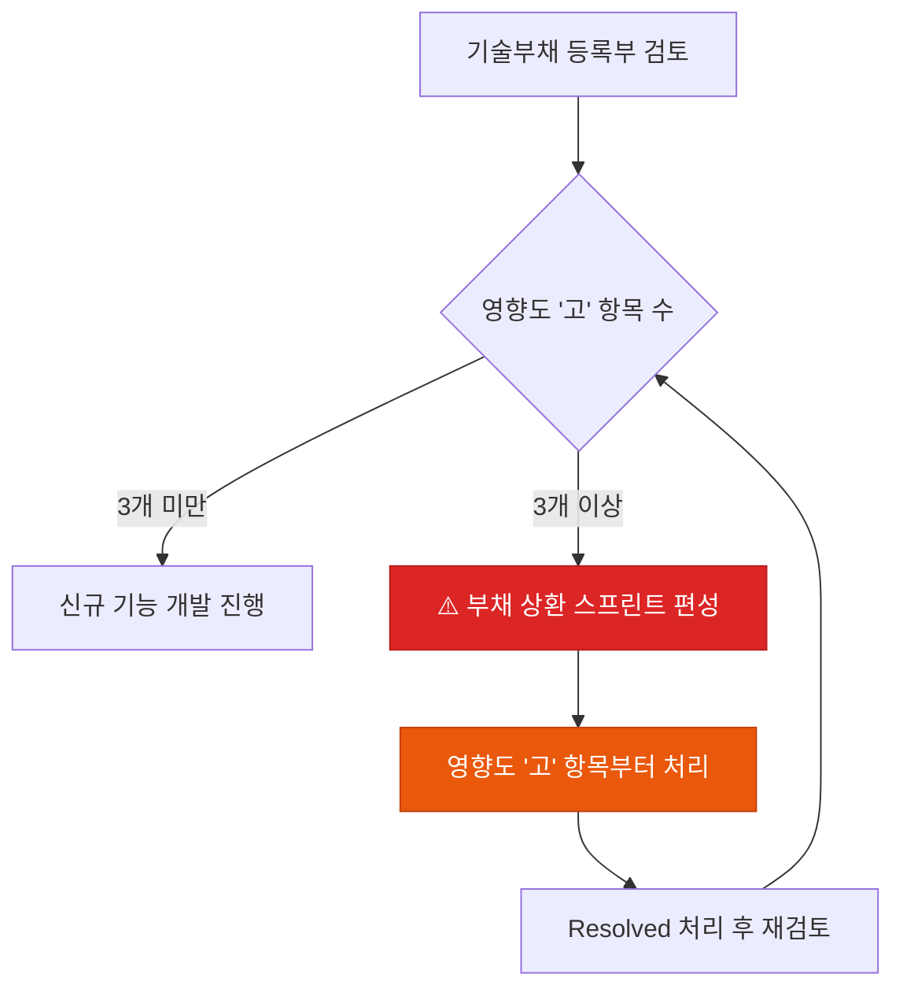

# 🚩 기술부채 등록부

AI가 생성한 코드 중 **"작동은 하지만 개선이 필요한 항목"**들을 체계적으로 관리합니다.

## 왜 AI 코딩에서 기술부채 관리가 더 중요한가

AI는 빠르게 작동하는 코드를 생성하지만, 아래와 같은 패턴이 자주 발생합니다:

- 엣지 케이스를 하드코딩으로 처리
- 테스트 없이 구현만 완성
- 기존 패턴과 다른 방식으로 같은 문제를 해결 (중복 패턴)
- 성능보다 가독성을 우선해 비효율적인 쿼리 생성

이를 즉시 기록하지 않으면, 빠르게 쌓이는 부채를 나중에 감당하기 어려워집니다.

---

## 등록부 템플릿

아래 내용을 복사하여 `docs/debt/debt-register.md`로 저장하세요.

```markdown
# 🚩 기술부채 및 리스크 등록부

AI가 생성한 코드 중 '작동은 하지만 개선이 필요한 항목'들을 관리합니다.

| ID | 등록일 | 부채 항목 및 내용 | 영향도 | 상환 계획 | 상태 |
|:---|:---:|:---|:---:|:---|:---:|
| DB-001 | 05-03 | Auth 로직 내 하드코딩된 예외 처리 | 중 | 차주 리팩토링 스프린트 시 해결 | Open |
| DB-002 | 05-03 | 테스트 코드 커버리지 부족 (AI 생성 코드) | 고 | 기능 배포 후 3일 내 테스트 보강 | In Progress |

> **규칙**: 영향도가 '고'인 항목이 3개 이상일 경우,
> 신규 기능 개발보다 부채 상환을 우선합니다.
```

---

## 필드 정의

| 필드 | 설명 | 예시 |
|---|---|---|
| **ID** | `DB-NNN` 형식 순번 | DB-001 |
| **등록일** | MM-DD 형식 | 05-06 |
| **부채 항목** | 어느 파일/모듈의 무슨 문제인지 | `UserService.ts` 내 N+1 쿼리 |
| **영향도** | 하 / 중 / 고 | 고 |
| **상환 계획** | 언제, 어떻게 해결할지 | 다음 스프린트 내 쿼리 최적화 |
| **상태** | Open / In Progress / Resolved | Open |

### 영향도 기준

| 영향도 | 기준 |
|---|---|
| **고** | 보안·성능·데이터 정합성에 영향, 또는 다른 기능 개발을 막는 블로커 |
| **중** | 코드 품질 저하, 향후 확장 시 문제 가능성 |
| **하** | 네이밍, 주석, 소규모 리팩토링 등 |

---

## 부채 발견 시 AI 프롬프트

PR 리뷰 시 AI에게 자가 진단을 시키는 프롬프트:

```
방금 작성한 코드를 다음 관점에서 검토하고,
기술부채 등록부(debt-register.md) 형식으로 보고해줘:

1. 하드코딩된 값이나 임시 방편이 있는가?
2. 엣지 케이스 처리가 누락된 부분이 있는가?
3. 테스트가 없거나 불충분한 로직이 있는가?
4. 성능 문제가 예상되는 쿼리나 로직이 있는가?
5. 기존 패턴과 다른 방식으로 구현한 부분이 있는가?

각 항목을 DB-NNN 형식으로 정리해줘.
```

---

## 부채 상환 우선순위 결정 흐름


