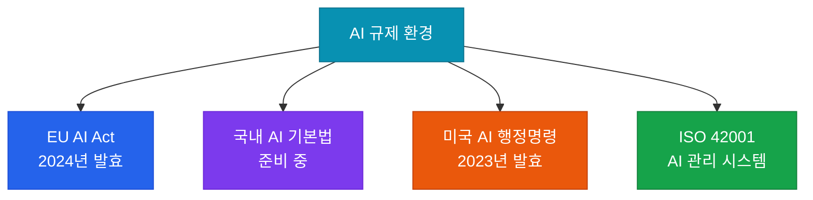

# 윤리 & 규제 준수

AI 윤리 가이드라인 적용 및 국내외 AI 규제 대응 전략

## 주요 AI 규제 현황



## EU AI Act 위험 분류

| 위험 수준 | 사례 | 요구사항 |
|---|---|---|
| **금지 (Prohibited)** | 사회 신용 점수, 실시간 생체 인식 | 전면 금지 |
| **고위험 (High-risk)** | 채용, 대출 심사, 의료 진단 AI | 엄격한 규제·감사 요구 |
| **제한 (Limited-risk)** | 챗봇, 딥페이크 | 투명성 의무 |
| **최소 위험 (Minimal)** | 스팸 필터, AI 게임 | 자율 규제 |

## AI 윤리 원칙 적용

### Anthropic의 Constitutional AI 방식

모델 학습 단계에서 윤리 원칙을 내재화하는 접근:

```
원칙 예시:
- 사람에게 해롭거나 위험한 정보를 제공하지 말 것
- 차별적이거나 편향된 답변을 생성하지 말 것
- 불확실한 경우 불확실함을 명시할 것
- 개인의 프라이버시를 존중할 것
```

### 실무 적용 체크리스트

**편향성 검토**:
- [ ] 학습 데이터의 인구통계학적 편향 감사
- [ ] 서로 다른 그룹에 대한 모델 출력 공정성 테스트
- [ ] 정기적인 편향성 모니터링 (분기별)

**투명성 확보**:
- [ ] AI가 생성한 콘텐츠임을 사용자에게 명시
- [ ] AI 의사결정에 대한 설명 제공 (설명 가능성)
- [ ] 데이터 사용 및 개인정보 처리 고지

**책임성 확립**:
- [ ] AI 시스템 소유자 및 책임자 명확화
- [ ] AI 관련 사고 보고 절차 수립
- [ ] 정기적인 윤리 검토 위원회 운영
