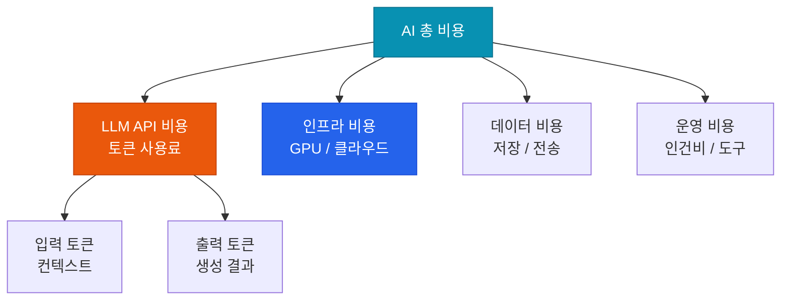

# AI FinOps

AI 비용을 거버넌스 차원에서 관리하여 지속 가능한 AI 운영 확보

## AI 비용 구조



## 비용 최적화 레버

### 1. 모델 다운그레이드 (가장 효과 큼)

| 모델 전환 | 비용 절감 | 성능 영향 |
|---|---|---|
| Claude Opus → Sonnet | ~80% 절감 | 복잡도 낮은 태스크에서 미미 |
| Claude Sonnet → Haiku | ~70% 절감 | 단순 분류/요약에서 미미 |
| GPT-4o → GPT-4o-mini | ~85% 절감 | 대부분 태스크에서 충분 |

### 2. 프롬프트 캐싱

```python
# Anthropic 프롬프트 캐싱 예시
# 시스템 프롬프트가 반복될 때 캐시 활용
messages = [
    {
        "role": "user",
        "content": [
            {
                "type": "text",
                "text": long_system_context,
                "cache_control": {"type": "ephemeral"}  # 캐시 마킹
            },
            {"type": "text", "text": user_query}
        ]
    }
]
# 캐시 적중 시 입력 토큰 비용 90% 절감
```

### 3. 배치 처리

실시간 응답이 불필요한 작업은 배치 API로 50% 절감:

```python
# Anthropic Message Batches API
batch_request = {
    "requests": [
        {"custom_id": "task_1", "params": {...}},
        {"custom_id": "task_2", "params": {...}},
    ]
}
```

## FinOps 대시보드 KPI

| KPI | 설명 | 목표 |
|---|---|---|
| **비용/기능 단위** | 문서 요약 1건당 비용 | 예산 내 |
| **캐시 히트율** | 프롬프트 캐싱 효율 | > 40% |
| **토큰 효율** | 출력 품질 대비 토큰 사용량 | 최적화 추이 |
| **월별 비용 성장률** | MoM 비용 증가율 | 사용량 증가율 이하 |
