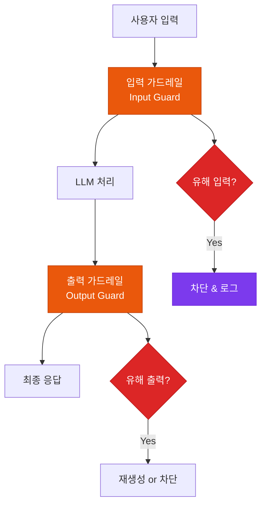

# 가드레일 & 보안

유해 콘텐츠 차단, 개인정보·기업 기밀 유출 방지를 위한 다층 보안 전략

## 다층 보안 아키텍처



## 입력 가드레일

### Prompt Injection 탐지

```python
# 프롬프트 주입 공격 패턴 탐지
injection_patterns = [
    r"ignore previous instructions",
    r"system prompt",
    r"you are now",
    r"jailbreak",
]

def detect_injection(user_input: str) -> bool:
    for pattern in injection_patterns:
        if re.search(pattern, user_input, re.IGNORECASE):
            return True
    return False
```

### PII 탐지 & 마스킹

```python
# 개인정보 자동 탐지 및 마스킹
pii_patterns = {
    "email": r"[a-zA-Z0-9._%+-]+@[a-zA-Z0-9.-]+\.[a-zA-Z]{2,}",
    "phone": r"010[-\s]?\d{4}[-\s]?\d{4}",
    "resident_id": r"\d{6}[-]\d{7}",
}
```

## 출력 가드레일

### Hallucination 탐지

```python
# 출력이 소스 문서에 근거하는지 확인
faithfulness_score = evaluate_faithfulness(
    response=llm_output,
    context=retrieved_documents
)
if faithfulness_score < 0.7:
    flag_for_review(llm_output)
```

### 콘텐츠 필터링 분류

| 카테고리 | 처리 방식 |
|---|---|
| **폭력적 콘텐츠** | 즉시 차단 |
| **성적 콘텐츠** | 즉시 차단 |
| **혐오 발언** | 즉시 차단 |
| **개인정보 포함** | 마스킹 후 허용 |
| **기업 기밀** | 검토 후 허용 |
| **의료/법률 조언** | 면책 고지 추가 |

## 추천 도구

- **Guardrails AI**: Python 기반 오픈소스 가드레일 프레임워크
- **LlamaGuard**: Meta의 LLM 기반 콘텐츠 안전 분류기
- **NeMo Guardrails**: NVIDIA의 대화형 AI 가드레일
- **AWS Bedrock Guardrails**: 관리형 클라우드 가드레일
