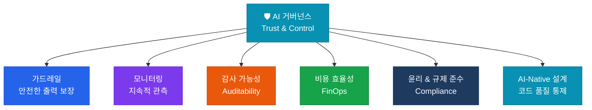

# 🛡 AI 거버넌스

**Trust & Control** — AI가 기업과 사회의 기준 내에서 안전하고 일관되게 작동하도록 통제

## 이 영역의 역할

AI 거버넌스는 5개 영역 프레임워크의 **Foundation(기반)** 중 신뢰성 측면을 담당합니다. 인프라가 물리적 기반이라면, 거버넌스는 AI 시스템의 **논리적·제도적 기반**입니다.

## 핵심 구성 요소

| 구성 요소 | 설명 |
|---|---|
| **가드레일 & 보안** | 유해 콘텐츠 차단, 개인정보·기업 기밀 유출 방지 |
| **모니터링 & 관측성** | Hallucination 체크, 지연 시간, 비용 추적 |
| **감사 가능성** | AI 결과물의 추적 가능한 로그 및 사후 검증 체계 |
| **FinOps** | AI 비용을 거버넌스 차원에서 관리하는 지속 가능성 확보 |
| **윤리 & 규제 준수** | AI 윤리 가이드라인, EU AI Act 등 법규 대응 |
| **AI-Native 설계** | ADR·기술부채·PR 체크리스트로 AI 생성 코드 품질 통제 |

## 보안을 넘어 FinOps로

거버넌스는 보안만이 아닙니다. **비용 효율성(FinOps)**을 거버넌스 차원에서 관리하여 AI 도입의 지속 가능성을 확보해야 합니다.

## Health Check 질문

> "현재 우리 AI 시스템은 결과값이 왜 그렇게 나왔는지 사후 검증이 가능한가?"

- [ ] 모든 AI 요청·응답이 로깅되고 있는가?
- [ ] Hallucination 탐지 메커니즘이 프로덕션에 적용되어 있는가?
- [ ] 월별 AI 비용이 예산 대비 추적 및 최적화되고 있는가?
- [ ] EU AI Act 등 관련 규제 준수 상태를 정기적으로 검토하는가?
- [ ] AI 생성 코드가 ADR 기준에 맞게 작성되고 있는가?
