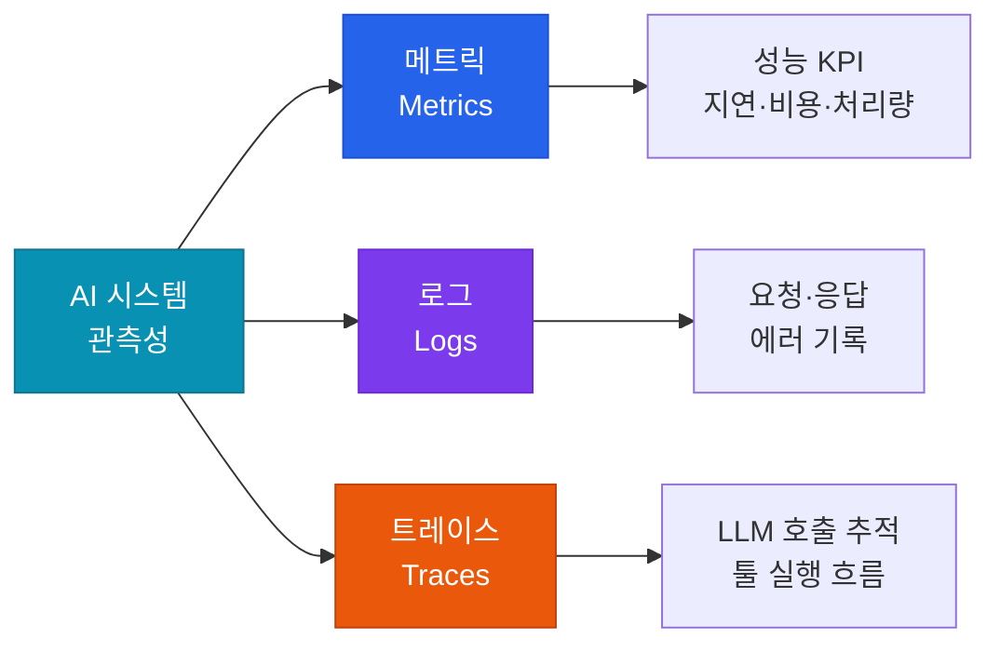

# 모니터링 & 관측성

AI 시스템의 품질, 성능, 비용을 실시간으로 추적하는 관측 체계

## 관측성 3대 요소



## 핵심 모니터링 지표

### 품질 지표

| 지표 | 설명 | 목표 |
|---|---|---|
| **Faithfulness** | 출력이 컨텍스트에 근거하는 정도 | > 0.85 |
| **Answer Relevancy** | 답변의 질문 관련성 | > 0.85 |
| **Hallucination Rate** | 사실과 다른 출력 비율 | < 5% |

### 성능 지표

| 지표 | 설명 | 목표 |
|---|---|---|
| **TTFT** | Time To First Token (첫 토큰까지 시간) | < 1s |
| **TPS** | Tokens Per Second (생성 속도) | > 30 TPS |
| **P95 Latency** | 95번째 백분위 응답 시간 | < 3s |

### 비용 지표

| 지표 | 설명 |
|---|---|
| **비용/요청** | 요청 1건당 평균 LLM 비용 |
| **월별 토큰 사용량** | 모델별 토큰 소비 추이 |
| **캐시 히트율** | 프롬프트 캐싱 효율 |

## LLM 모니터링 도구

| 도구 | 특징 | 적합한 용도 |
|---|---|---|
| **LangSmith** | LangChain 생태계 통합 | LangChain 기반 앱 |
| **Langfuse** | 오픈소스, 셀프 호스팅 | 비용 민감, 보안 중시 |
| **Arize Phoenix** | 모델 성능 & 드리프트 | ML Ops 통합 |
| **Helicone** | 간단한 프록시 방식 | 빠른 도입 |

## 알림 설정 권장사항

```yaml
alerts:
  - name: high_hallucination_rate
    condition: hallucination_rate > 0.10
    severity: critical
    action: page_on_call

  - name: cost_spike
    condition: hourly_cost > budget_threshold * 1.5
    severity: warning
    action: slack_notification

  - name: latency_degradation
    condition: p95_latency > 5000ms
    severity: warning
    action: slack_notification
```
