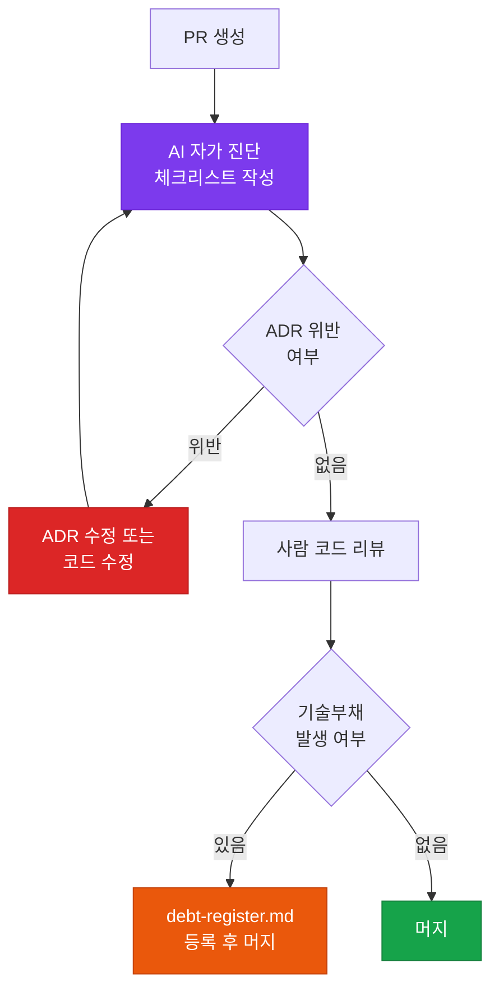

# PR 체크리스트

AI 개발 확인 사항이 포함된 Pull Request 리뷰 가이드입니다.

## 사용 방법

아래 템플릿을 `.github/PULL_REQUEST_TEMPLATE.md`로 저장하면, GitHub에서 PR 생성 시 자동으로 불러옵니다.

---

## 템플릿

```markdown
## 📝 변경 사항 요약
- [ ] 어떤 기능을 구현/수정했나요?
- [ ] 관련 이슈/티켓 번호:

## 🤖 AI 개발 확인 사항
- [ ] AI가 생성한 코드의 비즈니스 로직을 사람이 검증했나요?
- [ ] AI에게 관련 ADR 및 설계 문서를 컨텍스트로 제공했나요?
- [ ] 불필요한 AI 주석이나 테스트용 코드가 제거되었나요?

## 🏗️ 설계 및 품질 체크
- [ ] 기존 아키텍처(C4 Model)와 충돌하는 부분은 없나요?
- [ ] 새로운 의사결정이 있었다면 ADR을 작성/수정했나요?
- [ ] 새로 발생한 기술부채를 `debt-register.md`에 기록했나요?
- [ ] 단위 테스트가 포함되었으며 통과했나요?

## 📸 스크린샷 (필요 시)
(UI 변경이 있는 경우 첨부)
```

---

## 체크리스트 항목 해설

### 🤖 AI 개발 확인 사항

**"AI가 생성한 코드의 비즈니스 로직을 사람이 검증했나요?"**

AI는 문법적으로 올바르고 작동하는 코드를 생성하지만, 비즈니스 규칙을 잘못 해석할 수 있습니다. 예를 들어 할인율 계산, 권한 체크, 데이터 유효성 규칙 등은 반드시 사람이 직접 검토해야 합니다.

**"AI에게 관련 ADR을 컨텍스트로 제공했나요?"**

ADR 없이 코드를 생성하면 AI가 기존 팀 결정과 다른 패턴을 사용할 수 있습니다. 코딩 시작 전 관련 ADR을 컨텍스트로 제공했는지 확인합니다.

**"불필요한 AI 주석이나 테스트용 코드가 제거되었나요?"**

AI는 종종 `// TODO: implement this`, `// This is a placeholder`, `console.log` 등을 남깁니다. 프로덕션 코드에 이런 항목이 없는지 확인합니다.

### 🏗️ 설계 및 품질 체크

**"새로 발생한 기술부채를 기록했나요?"**

PR 리뷰 시 아래 AI 프롬프트로 자가 진단을 실행하면 누락을 방지할 수 있습니다.

```
이 PR의 변경 코드를 검토하고, 기술부채로 등록이 필요한 항목을
debt-register.md 형식으로 정리해줘.
의도적으로 남긴 임시 구현, 테스트 미비, 성능 이슈 가능성을 중심으로 확인해줘.
```

---

## PR 리뷰 흐름



---

## AI에게 PR 체크리스트 자가 진단 시키기

PR을 올리기 전, AI에게 직접 체크리스트를 기반으로 자가 진단을 요청합니다:

```
방금 작성한 코드를 .github/PULL_REQUEST_TEMPLATE.md의
체크리스트 항목에 따라 자가 진단해줘.

각 항목을 [Pass / Fail / N/A]로 평가하고,
Fail 항목이 있으면 수정 방법을 제안해줘.
```

이 방식으로 리뷰어가 발견할 문제를 사전에 제거하고, 기술부채 누락을 방지할 수 있습니다.
