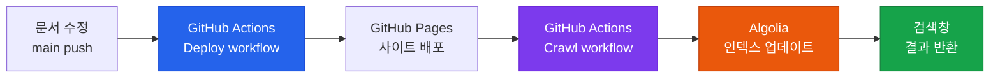

# Algolia DocSearch 검색 설정 가이드

Docusaurus 사이트에 Algolia DocSearch를 연동하고, GitHub Actions로 인덱싱을 자동화하는 전체 과정입니다.

## 구성 요소



## 사전 준비

- GitHub Pages로 배포 중인 Docusaurus v3 사이트
- GitHub 저장소 관리자 권한 (Secrets 등록용)
- Algolia 계정 (무료 플랜으로 충분)

---

## Step 1. Algolia 계정 및 인덱스 생성

1. [algolia.com](https://www.algolia.com) → **Start for free** 가입
2. 대시보드 → **Create index** → 인덱스 이름 입력 (예: `ai-eng`)
3. 좌측 메뉴 **Settings → API Keys** 에서 세 가지 값 확인

| 키 이름 | 용도 | 공개 여부 |
|---|---|---|
| **Application ID** | 앱 식별자 | 공개 가능 |
| **Search-Only API Key** | 검색 쿼리 실행 | 공개 가능 |
| **Write API Key** | 인덱스에 데이터 쓰기 | **비공개** |

---

## Step 2. GitHub Secrets 등록

저장소 → **Settings → Secrets and variables → Actions → Repository secrets**

| Secret 이름 | 값 |
|---|---|
| `ALGOLIA_APP_ID` | Application ID |
| `ALGOLIA_ADMIN_KEY` | **Write API Key** |

:::caution
`ALGOLIA_ADMIN_KEY`는 반드시 Repository Secrets에만 보관합니다. 코드에 직접 넣으면 안 됩니다.
:::

---

## Step 3. Docusaurus 설정

`docusaurus.config.ts`의 `themeConfig`에 `algolia` 블록을 추가합니다.

```typescript title="docusaurus.config.ts"
themeConfig: {
  algolia: {
    appId: 'YOUR_APP_ID',           // Application ID (공개 가능)
    apiKey: 'YOUR_SEARCH_ONLY_KEY', // Search-Only API Key (공개 가능)
    indexName: 'ai-eng',            // Step 1에서 만든 인덱스 이름
    contextualSearch: false,        // 단일 언어 사이트는 반드시 false
    searchPagePath: 'search',
  },
  // ...
}
```

:::tip contextualSearch: false 이유
`contextualSearch: true`이면 Docusaurus가 검색 쿼리에 `language:ko` 필터를 자동 추가합니다.
크롤러가 `language` 속성을 올바르게 설정하지 않으면 결과가 0건으로 나옵니다.
단일 언어 사이트에서는 `false`로 설정하세요.
:::

---

## Step 4. DocSearch 크롤러 설정 파일

`.algolia/config.json` 파일을 만들어 크롤러가 사이트를 어떻게 인덱싱할지 정의합니다.

```json title=".algolia/config.json"
{
  "index_name": "ai-eng",
  "start_urls": ["https://YOUR_USERNAME.github.io/YOUR_REPO/"],
  "sitemap_urls": ["https://YOUR_USERNAME.github.io/YOUR_REPO/sitemap.xml"],
  "sitemap_alternate_links": true,
  "stop_urls": [],
  "selectors": {
    "lvl0": {
      "selector": "(//ul[contains(@class,'menu__list')]//a[contains(@class, 'menu__link menu__link--sublist menu__link--active')]/text() | //nav[contains(@class, 'navbar')]//a[contains(@class, 'navbar__link--active')]/text())[last()]",
      "type": "xpath",
      "global": true,
      "default_value": "Documentation"
    },
    "lvl1": "header h1",
    "lvl2": "article h2",
    "lvl3": "article h3",
    "lvl4": "article h4",
    "lvl5": "article h5, article td:first-child",
    "lvl6": "article h6",
    "text": "article p, article li, article td:last-child"
  },
  "strip_chars": " .,;:#",
  "custom_settings": {
    "separatorsToIndex": "_",
    "attributesForFaceting": ["language", "version"],
    "attributesToRetrieve": [
      "hierarchy", "content", "anchor",
      "url", "url_without_anchor", "type"
    ]
  }
}
```

---

## Step 5. GitHub Actions 크롤러 워크플로우

`.github/workflows/algolia-crawl.yml` 파일을 만듭니다.

```yaml title=".github/workflows/algolia-crawl.yml"
name: Algolia DocSearch Crawl

on:
  workflow_run:
    workflows: ["Deploy to GitHub Pages"]  # 배포 워크플로우 이름과 일치해야 함
    types:
      - completed

jobs:
  crawl:
    name: Crawl and index with Algolia DocSearch
    runs-on: ubuntu-latest
    if: ${{ github.event.workflow_run.conclusion == 'success' }}
    steps:
      - uses: actions/checkout@v4

      - name: Wait for GitHub Pages to propagate
        run: sleep 30

      - name: Run DocSearch Scraper
        env:
          APPLICATION_ID: ${{ secrets.ALGOLIA_APP_ID }}
          API_KEY: ${{ secrets.ALGOLIA_ADMIN_KEY }}
        run: |
          CONFIG=$(cat .algolia/config.json)
          docker run --env APPLICATION_ID --env API_KEY \
            -e "CONFIG=$CONFIG" \
            algolia/docsearch-scraper
```

:::info Docker 환경
GitHub Actions의 `ubuntu-latest` 러너에는 Docker가 기본 설치되어 있어 별도 설정 없이 크롤러를 실행할 수 있습니다.
:::

---

## 동작 방식

`main` 브랜치에 push하면 두 워크플로우가 자동으로 순서대로 실행됩니다.

1. **Deploy to GitHub Pages** — 사이트 빌드 및 배포
2. **Algolia DocSearch Crawl** — 배포 완료 후 자동 트리거
   - 30초 대기 (GitHub Pages 전파 대기)
   - DocSearch 크롤러 실행
   - Algolia 인덱스 업데이트

## 검색 결과 확인

GitHub Actions 탭에서 두 번째 워크플로우 로그 끝에 `Nb hits: XXX` 가 표시되면 인덱싱 성공입니다.

```
Nb hits: 764
```

:::warning 로컬 개발 서버에서는 검색 불가
`npm run start` (개발 서버)에서는 Algolia 검색이 의도적으로 비활성화됩니다.
검색 기능은 배포된 사이트 또는 `npm run build && npm run serve`에서만 확인 가능합니다.
:::
