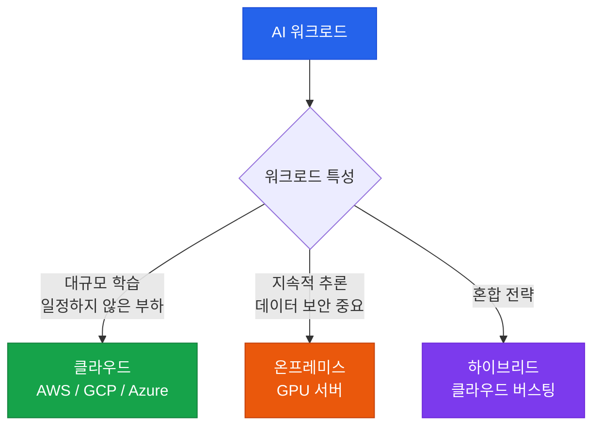

# 컴퓨팅 자원 관리

GPU/NPU 서버와 클라우드 인프라를 비용 효율적으로 운영하는 전략

## 온프레미스 vs 클라우드



## 클라우드 AI 서비스 비교

| 항목 | AWS Bedrock | Google Vertex AI | Azure AI |
|---|---|---|---|
| **주요 모델** | Claude, Llama, Titan | Gemini, PaLM | GPT-4, Phi |
| **파인튜닝** | 지원 | 지원 | 지원 |
| **온디맨드 가격** | 토큰당 과금 | 토큰당 과금 | 토큰당 과금 |
| **프로비전드 처리량** | 지원 | 지원 | 지원 |

## 비용 최적화 전략

### 1. 모델 계층화 (Model Tiering)

```
복잡한 작업 → 대형 모델 (Claude Opus, GPT-4o)
일반 작업  → 중형 모델 (Claude Sonnet, GPT-4o-mini)
단순 작업  → 소형 모델 (Claude Haiku, GPT-3.5)
```

### 2. 캐싱 전략

반복적으로 사용되는 프롬프트나 컨텍스트는 **프롬프트 캐싱**으로 비용을 최대 90%까지 절감할 수 있습니다.

### 3. 배치 처리

실시간 응답이 필요 없는 작업은 **배치 API**를 활용하여 비용을 50% 절감합니다.

## GPU 스펙 가이드

| 용도 | 권장 GPU | 비고 |
|---|---|---|
| **대규모 학습** | H100, A100 | 80GB VRAM 이상 |
| **미드사이즈 파인튜닝** | A10G, L40S | 24~48GB VRAM |
| **추론 서버** | T4, L4 | 16GB VRAM, 비용 효율 |
| **로컬 개발** | RTX 4090 | 24GB VRAM |
