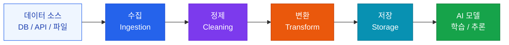

# 데이터 파이프라인

AI 학습 및 추론을 위한 실시간 데이터 수집·정제 체계

## 파이프라인 아키텍처



## 데이터 정제 체크리스트

- [ ] **중복 제거**: 동일한 데이터가 여러 번 학습에 영향을 주지 않도록
- [ ] **노이즈 제거**: 오탈자, 인코딩 오류, 불완전한 레코드 처리
- [ ] **PII 마스킹**: 개인정보(이름, 전화번호, 이메일) 자동 탐지 및 마스킹
- [ ] **레이블 검증**: 지도학습 데이터의 레이블 품질 검증
- [ ] **데이터 균형**: 클래스 불균형 문제 해결 (언더샘플링 / 오버샘플링)

## 스트리밍 vs 배치 처리

| 방식 | 적합한 경우 | 도구 |
|---|---|---|
| **실시간 스트리밍** | 실시간 추론, 이벤트 기반 | Apache Kafka, AWS Kinesis |
| **마이크로 배치** | 준실시간 (분 단위) | Apache Spark Streaming |
| **배치** | 학습 데이터 준비, 리포트 | Apache Spark, dbt |

## 추천 스택

```
수집:    Apache Kafka / AWS Kinesis
처리:    Apache Spark / dbt
저장:    S3 / GCS (원본) + PostgreSQL (구조화) + Pinecone (벡터)
오케스트레이션: Apache Airflow / Prefect
모니터링: Great Expectations (데이터 품질)
```
