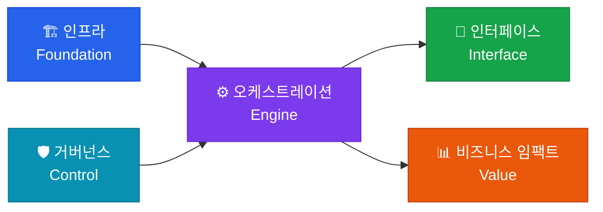

# 🏗 AI 인프라 & 아키텍처

**Foundation & Build** — AI 시스템이 구동되기 위한 가장 밑단의 물리적·논리적 기반

## 이 영역의 역할

AI 인프라 & 아키텍처는 전체 5개 영역 프레임워크의 **Foundation(기반)**에 해당합니다. 아무리 뛰어난 프롬프트와 오케스트레이션 전략이 있더라도, 이를 받쳐주는 인프라가 부실하면 전체 시스템은 흔들립니다.

## 핵심 구성 요소

| 구성 요소 | 설명 |
|---|---|
| **컴퓨팅 자원** | GPU/NPU 서버, 클라우드 인프라 최적화 |
| **모델 선택 및 튜닝** | 목적에 맞는 LLM 선정, 파인튜닝, 양자화 |
| **데이터 파이프라인** | AI 학습 및 추론을 위한 실시간 데이터 수집·정제 |
| **Vector DB** | 의미 기반 검색을 위한 벡터 데이터베이스 최적화 |
| **MCP 서버** | Model Context Protocol 기반 컨텍스트 관리 |

## 핵심 전략: 모델 믹스(Model Mix)

단순히 모델을 '보유'하는 것이 아니라, **특정 목적에 맞는 모델 믹스 전략**이 핵심입니다.

- **대형 모델**: 복잡한 추론, 창의적 작업
- **소형 모델**: 빠른 응답, 비용 효율적인 분류·요약
- **특화 모델**: 코드 생성, 이미지 이해, 음성 처리 등 도메인 특화 작업

## Health Check 질문

> "현재 우리 시스템의 인프라 영역은 목적에 맞는 모델 믹스 전략을 운영하고 있는가?"

- [ ] GPU/클라우드 비용이 예산 내에서 최적화되어 있는가?
- [ ] 프로덕션 환경에서 Vector DB 응답 시간이 SLA를 충족하는가?
- [ ] 파인튜닝 vs 프롬프트 엔지니어링 vs RAG 중 최적 전략을 선택했는가?
- [ ] MCP 서버가 안정적으로 컨텍스트를 제공하고 있는가?
