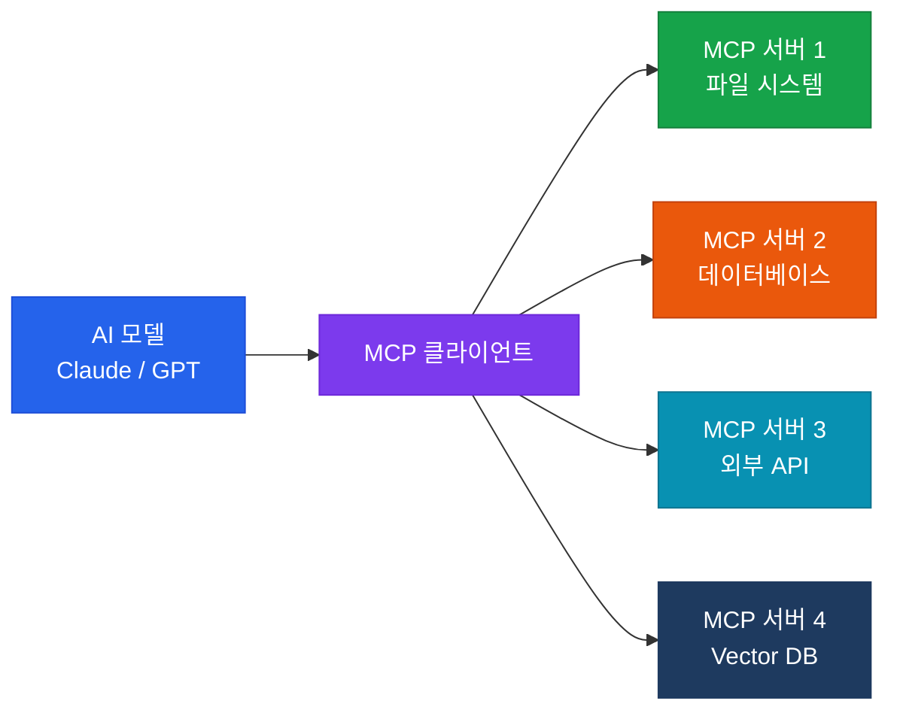

# MCP 서버 관리

Model Context Protocol — AI 모델에 외부 컨텍스트와 도구를 연결하는 표준 프로토콜

## MCP란?

**Model Context Protocol(MCP)**은 Anthropic이 2024년 발표한 오픈 표준으로, AI 모델이 외부 데이터 소스·도구·서비스와 안전하게 상호작용할 수 있도록 하는 프로토콜입니다.



## MCP의 핵심 구성 요소

| 구성 요소 | 역할 |
|---|---|
| **Resources** | 파일, DB 레코드, API 응답 등 데이터 노출 |
| **Tools** | AI가 호출할 수 있는 함수/액션 정의 |
| **Prompts** | 재사용 가능한 프롬프트 템플릿 |
| **Sampling** | 서버가 AI에게 추론 요청 가능 |

## MCP 서버 설정 예시

```json
{
  "mcpServers": {
    "filesystem": {
      "command": "npx",
      "args": ["-y", "@modelcontextprotocol/server-filesystem", "/path/to/docs"]
    },
    "database": {
      "command": "npx",
      "args": ["-y", "@modelcontextprotocol/server-postgres"],
      "env": {
        "DATABASE_URL": "postgresql://..."
      }
    }
  }
}
```

## 인프라 관점에서의 MCP 관리 포인트

- **보안**: MCP 서버가 접근 가능한 리소스를 최소 권한 원칙으로 제한
- **가용성**: MCP 서버 다운 시 AI 워크플로우에 미치는 영향 평가
- **성능**: 툴 호출 지연이 전체 응답 시간에 미치는 영향 모니터링
- **버전 관리**: MCP 서버 스키마 변경 시 하위 호환성 유지
