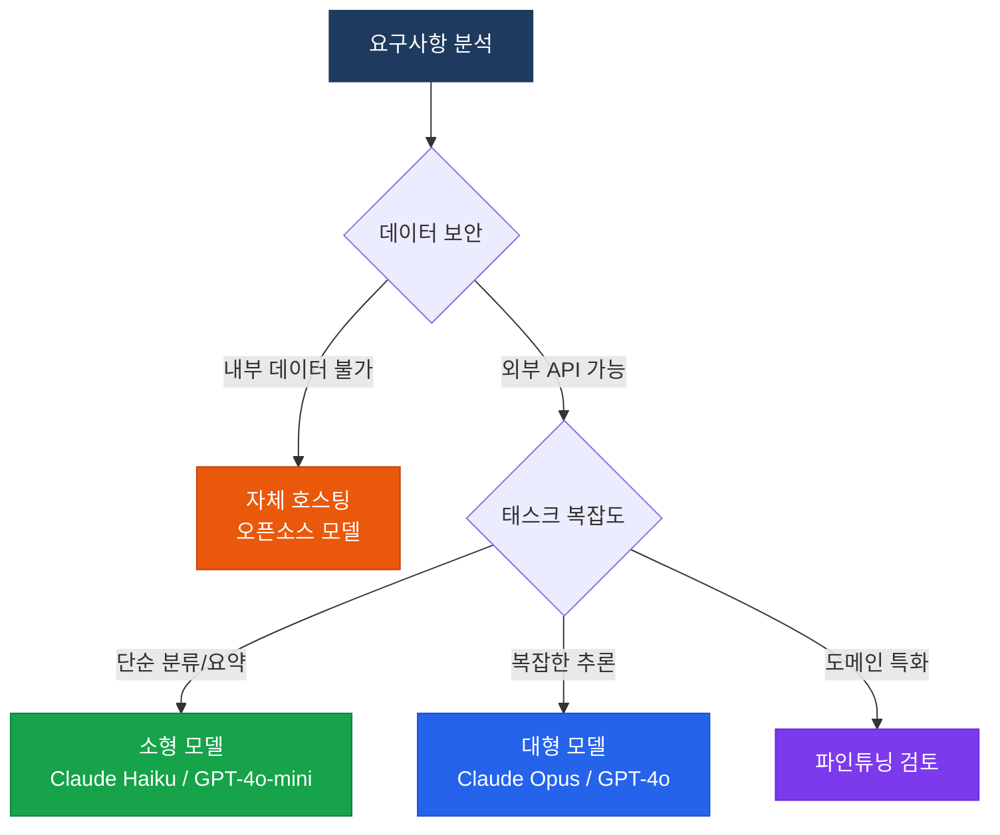

# 모델 선택 및 튜닝

목적에 맞는 LLM 선정, 파인튜닝, 양자화 전략

## 모델 선택 프레임워크



## 주요 LLM 비교 (2025)

| 모델 | 제공사 | 강점 | 컨텍스트 |
|---|---|---|---|
| **Claude Opus 4** | Anthropic | 복잡한 추론, 코딩 | 200K 토큰 |
| **Claude Sonnet 4** | Anthropic | 균형 잡힌 성능/비용 | 200K 토큰 |
| **Claude Haiku 4** | Anthropic | 빠른 속도, 저비용 | 200K 토큰 |
| **GPT-4o** | OpenAI | 멀티모달, 범용 | 128K 토큰 |
| **Gemini 2.0 Flash** | Google | 멀티모달, 속도 | 1M 토큰 |
| **Llama 3.3** | Meta | 오픈소스, 자체 호스팅 | 128K 토큰 |

## 튜닝 전략 비교

### 프롬프트 엔지니어링
- **적합**: 빠른 프로토타이핑, 소량 데이터
- **비용**: 낮음
- **효과**: 중간

### RAG (Retrieval-Augmented Generation)
- **적합**: 최신 정보 반영, 도메인 지식 주입
- **비용**: 중간
- **효과**: 높음 (지식 정확도)

### 파인튜닝 (Fine-tuning)
- **적합**: 특정 스타일/형식, 대량 반복 작업
- **비용**: 높음 (초기 투자)
- **효과**: 높음 (스타일 일관성)

## 양자화 (Quantization)

오픈소스 모델 자체 호스팅 시 VRAM 절감을 위한 양자화 전략:

```
FP32 → FP16: VRAM 50% 절감, 성능 손실 미미
FP16 → INT8: VRAM 추가 50% 절감, 성능 소폭 저하
INT8 → INT4: VRAM 추가 50% 절감, 성능 저하 주의
```

**추천 도구**: `llama.cpp`, `GPTQ`, `AWQ`, `bitsandbytes`
