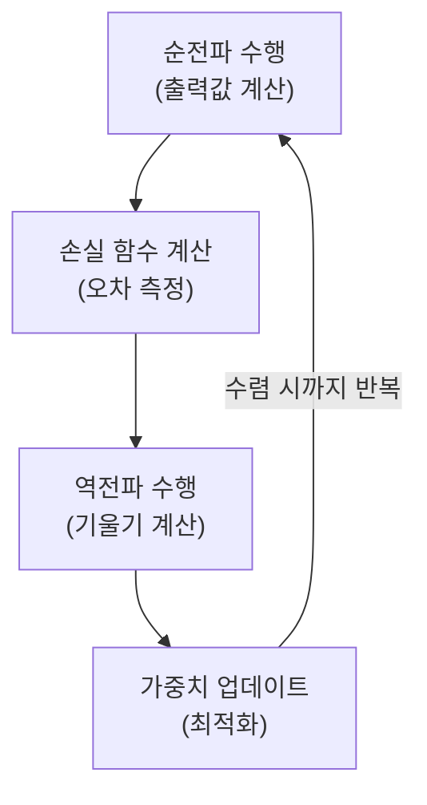

# Backpropagation

## I. 오차의 역방향 전파와 연쇄 법칙, Backpropagation 개요

**정의**: 신경망의 출력값과 실제값 사이의 오차( **Error** )를 역방향으로 전파하여, 각 층의 가중치( **Weights** )를 효율적으로 업데이트하는 미분 기반의 학습 알고리즘  

**특징**:  
( **연쇄 법칙** ) 미분의 연쇄 법칙( **Chain Rule** )을 활용하여 다층 구조에서도 각 가중치의 기여도를 계산  
( **효율성** ) 모든 가중치에 대한 편미분을 한 번의 역방향 패스로 해결하여 계산 복잡도 감소  
( **최적화 기초** ) 경사 하강법( **Gradient Descent** )과 결합하여 신경망이 목표 함수에 수렴하게 하는 핵심 동력  

## II. Backpropagation의 상세 메커니즘 및 수식 구조

### 가. 역전파 알고리즘의 4단계 프로세스

### 나. 핵심 구성 요소 및 수학적 원리

| 구성 요소 | 상세 설명 | 비고 |
| :--- | :--- | :--- |
| **연쇄 법칙** | 복합 함수의 미분을 하위 함수 미분의 곱으로 나타내는 원리 | **Chain Rule** |
| **손실 함수** | 모델의 예측 오차를 수치화 (예: **MSE**, **Log Loss**) | **Loss Function** |
| **기울기** | 손실 함수를 가중치로 미분한 값으로 업데이트 방향 결정 | **Gradient** |
| **학습률** | 가중치를 한 번에 얼마나 업데이트할지 결정하는 상수 | **Learning Rate** |

## III. Backpropagation의 한계와 극복 기술

| 항목 | 한계점 (Issues) | 극복 기술 (Solutions) |
| :--- | :--- | :--- |
| **기울기 소실** | 층이 깊어질수록 기울기가 0에 수렴 ( **Vanishing** ) | **ReLU**, **Batch Norm**, **ResNet** |
| **기울기 폭주** | 기울기가 급격히 커져 학습이 불안정 ( **Exploding** ) | **Gradient Clipping**, **Weight Initialization** |
| **국소 최적해** | 전체 최솟값이 아닌 국소적인 홈에 빠짐 ( **Local Minima** ) | **Momentum**, **Adam**, **Stochasticity** |

**기술 동향**: 초기의 역전파 알고리즘은 깊은 망 학습에 한계가 있었으나, 활성화 함수의 변경과 정규화 기법의 도입으로 **Deep Learning** 시대를 여는 결정적인 계기가 됨
