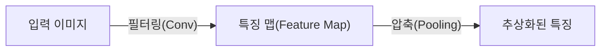
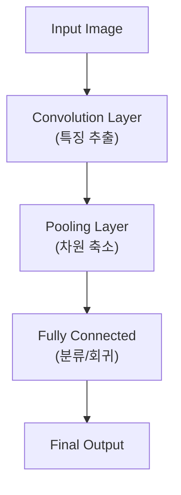

# Convolutional Neural Network (CNN)

## I. 공간 정보의 유지와 특징 추출, CNN 개요

**정의**: 이미지의 공간적 구조( **Spatial Structure** )를 유지하면서 국소적 특징을 추출하기 위해 컨볼루션(합성곱) 연산을 사용하는 신경망 아키텍처  

**특징**:  
( **위치 불변성** ) 특징이 이미지의 어느 위치에 있어도 동일하게 인식 가능한 **Translation Invariance** 확보  
( **파라미터 공유** ) 필터를 공유하여 완전 연결망 대비 학습해야 할 파라미터 수를 획기적으로 절감  
( **계층적 구조** ) 하위 층에서는 선/점, 상위 층에서는 복잡한 물체의 형태를 단계적으로 학습  

## II. CNN의 주요 연산 및 구성 레이어

### 가. CNN의 특징 추출 및 분류 프로세스

### 나. 핵심 구성 요소 및 기능

| 구성 요소 | 상세 설명 | 핵심 키워드 |
| :--- | :--- | :--- |
| **Filter (Kernel)** | 이미지 위를 슬라이딩하며 국소적인 특징을 추출하는 가중치 행렬 | **Shared Weights** |
| **Stride** | 필터를 이동시키는 간격으로 출력 데이터의 크기를 조절 | **Step Size** |
| **Padding** | 외곽에 특정 값(0 등)을 채워 출력 크기 유지 및 가장자리 정보 손실 방지 | **Zero Padding** |
| **Pooling** | 특정 영역의 대푯값(Max/Avg)을 뽑아 특징을 압축하고 노이즈 제거 | **Sub-sampling** |

## III. CNN의 대표적인 모델 발전사

| 모델명 | 주요 혁신 내용 | 비고 |
| :--- | :--- | :--- |
| **LeNet-5** | 최초의 실용적 CNN 아키텍처 (수표 숫자 인식) | 1998, Yann LeCun |
| **AlexNet** | GPU 사용, ReLU, Dropout 도입으로 딥러닝 붐 유도 | 2012 ImageNet 우승 |
| **VGGNet** | 3x3 작은 필터를 깊게 쌓는 구조의 효율성 증명 | 단순하고 깊은 구조 |
| **ResNet** | **Residual Learning** (Skip Connection)으로 100층 이상 학습 성공 | 기울기 소실 해결 |

**기술 동향**: 현재 CNN은 영상 인식뿐만 아니라 자율주행, 의료 영상 판독, 그리고 비전 트랜스포머( **ViT** )와 결합하여 더욱 고도화된 시각 지능으로 발전 중
