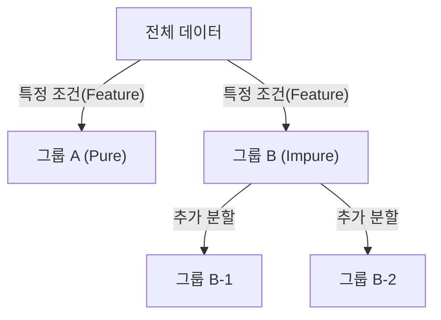
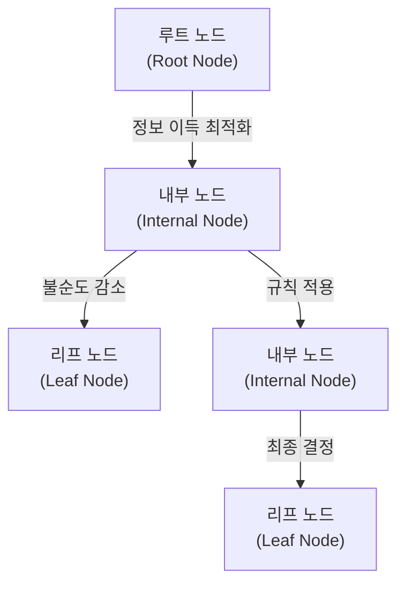

# Decision Tree

## I. 데이터의 분할과 정복, Decision Tree 개요

**정의**: 데이터에 존재하는 패턴을 예측 가능한 규칙들의 조합으로 나타내며, 전체 학습 데이터를 나무( **Tree** ) 구조로 도식화하여 분류와 회귀를 수행하는 알고리즘  

**특징**:  
( **가시성** ) 의사결정 과정을 시각적으로 표현하여 비전문가도 쉽게 이해 가능한 화이트박스( **White-box** ) 모델  
( **전처리 용이성** ) 데이터의 정규화나 스케일링 등 복잡한 전처리 과정의 영향이 적음  
( **비모수적 모델** ) 데이터의 분포에 대한 가정이 필요 없는 유연한 구조  

## II. Decision Tree의 핵심 알고리즘 및 구성 요소

### 가. 의사결정나무의 분할 및 구축 메커니즘

### 나. 주요 지표 및 구성 요소

| 구분 | 주요 내용 | 상세 설명 |
| :--- | :--- | :--- |
| **정보 엔트로피** | `Entropy = -Σ p log(p)` | 데이터 집합의 무질서도 혹은 불확실성을 측정하는 지표 |
| **지니 계수** | `Gini = 1 - Σ p²` | 데이터의 불순도를 측정하며, CART 알고리즘의 기본 지표 |
| **정보 이득** | **Information Gain** | 분할 전후의 엔트로피 차이로, 이 값이 최대가 되는 변수 선택 |
| **가지치기** | **Pruning** | 과적합( **Overfitting** )을 방지하기 위해 불필요한 가지를 제거 |

## III. Decision Tree의 한계점 및 발전 방향

| 항목 | 한계점 | 대응 방안 (발전 방향) |
| :--- | :--- | :--- |
| **변동성** | 데이터의 작은 변화에도 트리 구조가 크게 바뀜 | **Ensemble** ( **Random Forest** ) 기법 활용 |
| **과적합** | 학습 데이터에 너무 최적화되어 일반화 성능 저하 | **Pruning** 수행 및 하이퍼파라미터( **Max Depth** ) 조절 |
| **편향성** | 범주 개수가 많은 변수를 선택할 가능성이 높음 | **Gain Ratio** 등 보정된 지표 사용 |

**기술 동향**: 단일 의사결정나무의 한계를 극복하기 위해 여러 개의 트리를 결합하는 배깅( **Bagging** ), 부스팅( **Boosting** ) 기술이 XGBoost, LightGBM 등 현대 정형 데이터 분석의 핵심 기술로 자리 잡음
