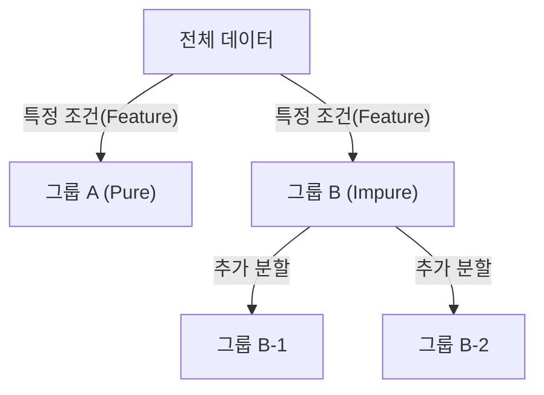
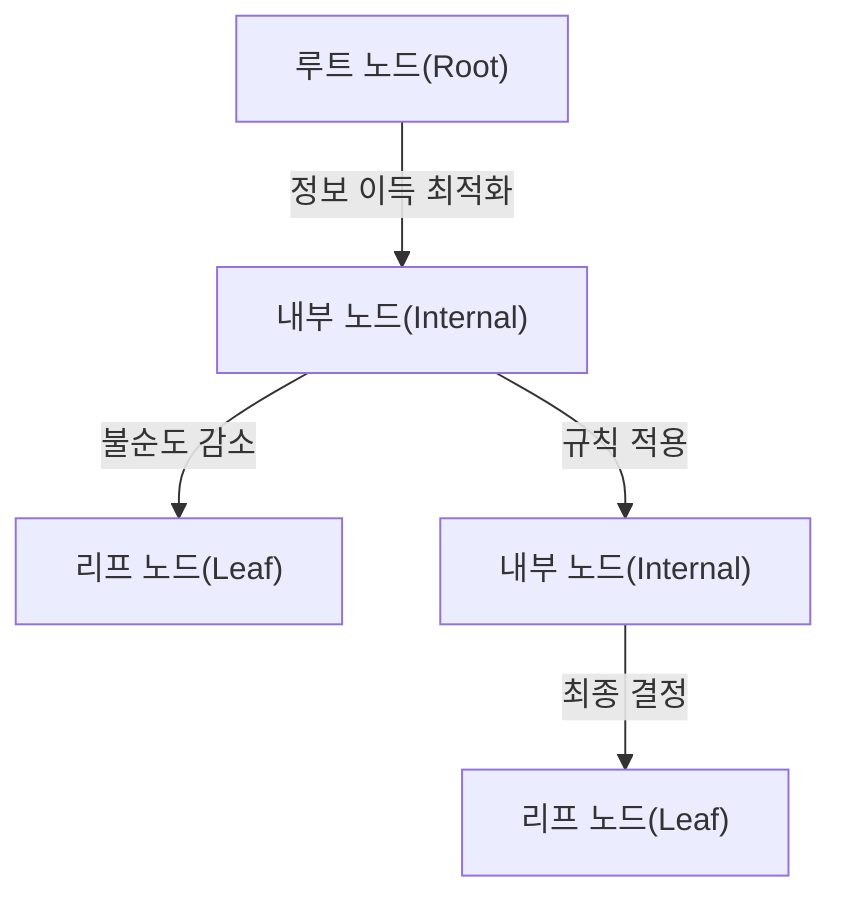

# Decision Tree

## I. 데이터의 분할과 정복, Decision Tree 개요

**정의**: 전체 학습 데이터를 특정 조건에 따라 하위 그룹으로 분할하여 나무( **Tree** ) 구조로 도식화하고, 이를 통해 분류와 회귀를 수행하는 규칙 기반의 알고리즘  

**특징**:  
( **높은 가독성** ) 의사결정 과정을 시각화하여 표현하므로 비전문가도 추론 근거를 쉽게 파악 가능한 `"**White-box**"` 모델  
( **데이터 유연성** ) 정규화나 스케일링 등 복잡한 데이터 전처리의 영향이 적으며 수치형과 범주형 데이터를 동시에 처리 가능  
( **직관적 해석** ) 최상위 노드에서 하위 노드로 이어지는 규칙들의 조합으로 결과가 도출되어 로직의 설명력이 매우 뛰어남  

## II. Decision Tree의 상세 메커니즘 및 구성 요소

### 가. 의사결정나무의 분할 메커니즘

### 나. 핵심 지표 및 상세 기능

| 구성 요소 | 상세 설명 | 비고 |
| :--- | :--- | :--- |
| **정보 엔트로피** | 데이터 집합의 무질서도를 나타내며 분할 전후의 불확실성 측정 지표 | **Entropy** |
| **지니 계수** | 데이터의 불순도를 나타내며 이 값이 최소화되는 방향으로 분할 수행 | **Gini Index** |
| **정보 이득** | 분할을 통해 감소하는 엔트로피의 양으로 변수 선택의 기준이 됨 | **Information Gain** |
| **가지치기** | 과적합 방지를 위해 모델의 복잡도를 줄이고 하위 가지를 제거하는 기법 | **Pruning** |

## III. Decision Tree의 기술적 과제 및 발전 방향

### 가. 한계점 및 보완 전략

| 항목 | 상세 내용 | 해결 방안 |
| :--- | :--- | :--- |
| **과적합(Overfitting)** | 학습 데이터에 너무 세세하게 반응하여 일반화 성능이 저하되는 현상 | **Pruning**, **Max Depth** 설정 |
| **모델 불안정성** | 데이터의 미세한 변화에도 전체 트리 구조가 민감하게 변동함 | **Ensemble** 기법 적용 |
| **편향적 분할** | 특정 범주의 개수가 많은 변수를 우선적으로 선택하려는 경향 | **Gain Ratio** 등 보정 지표 사용 |

### 나. 기술 동향

( **Ensemble Evolution** ) 단일 트리의 한계를 극복하기 위해 **Random Forest**, **XGBoost**, **LightGBM** 등 앙상블 기반의 강력한 모델로 진화하였습니다.  
( **Explainable AI** ) 복잡한 딥러닝 모델의 의사결정을 설명하기 위한 대리 모델( **Surrogate Model** )로서 여전히 핵심적인 역할을 수행하고 있습니다.  
