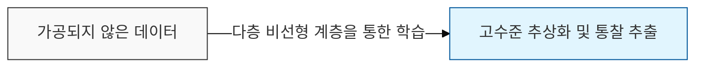
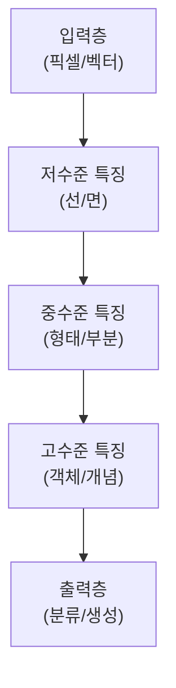

# Deep Learning

## I. 심층 신경망을 통한 고수준 추상화, Deep Learning 개요

**정의**: 신경망의 은닉층( **Hidden Layers** )을 깊게 쌓아 데이터의 복잡한 특징을 계층적으로 자동 추출하고 학습하는 기계학습의 한 분야  

**특징**:  
( **특징 학습** ) 사람이 직접 특징을 설계( **Feature Engineering** )하지 않고 모델이 데이터로부터 직접 학습  
( **종단간 학습** ) 입력부터 출력까지 하나의 거대한 신경망으로 연결되는 **End-to-End** 방식  
( **확장성** ) 데이터와 컴퓨팅 자원( **GPU** )이 늘어날수록 성능이 지속적으로 향상되는 경향성  

## II. Deep Learning의 계층적 구조 및 핵심 요소

### 가. 심층 학습의 데이터 흐름 및 표현 학습

### 나. 딥러닝 성공의 3대 핵심 요소

| 요소 | 상세 내용 | 기여점 |
| :--- | :--- | :--- |
| **빅데이터** | 소셜 미디어, **IoT** 등을 통한 대규모 학습 데이터 확보 | 모델의 일반화 성능 확보 |
| **컴퓨팅 파워** | **GPU**, **TPU** 등 대규모 병렬 연산 장치의 발전 | 깊은 망의 학습 시간 단축 |
| **알고리즘 혁신** | **ReLU**, **Dropout**, **Batch Norm** 등의 기법 등장 | 기울기 소실 문제 해결 |

## III. Deep Learning의 주요 아키텍처 및 응용

| 아키텍처 | 핵심 특징 | 주요 응용 분야 |
| :--- | :--- | :--- |
| **CNN** | 공간적 특징 추출 ( **Spatial Features** ) | 이미지 인식, 의료 영상 분석 |
| **RNN**/**LSTM** | 순차적 데이터 처리 ( **Sequential Data** ) | 번역, 시계열 예측, 음성 인식 |
| **Transformer** | 병렬 어텐션 메커니즘 ( **Self-Attention** ) | **LLM**, 자연어 이해 및 생성 |
| **GAN** | 생성자와 판별자의 경쟁 학습 | 이미지 합성, 스타일 변환 |

**기술 동향**: 현재 딥러닝은 단순 분류를 넘어 생성형 AI( **Generative AI** )로 진화하고 있으며, 모델의 크기를 극도로 키운 거대 모델( **Foundation Model** )이 산업 전반의 표준이 됨
