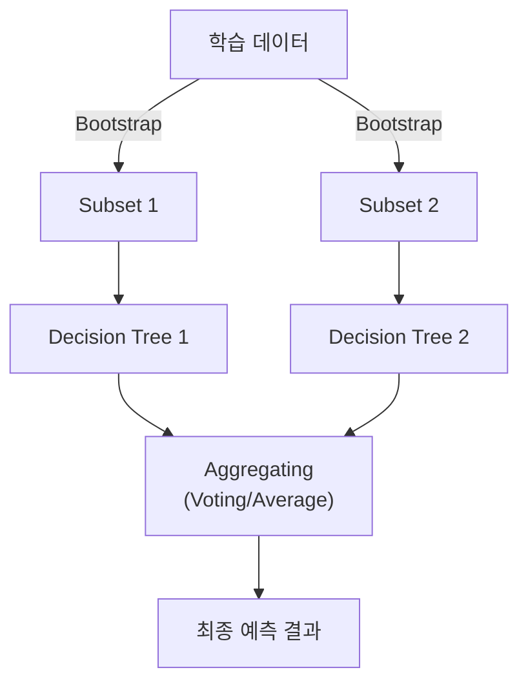
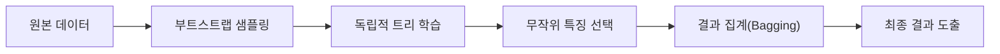

# Ensemble & Random Forest

## I. 집단 지성을 통한 예측력 극대화, Ensemble & Random Forest 개요

**정의**: 여러 개의 약한 학습기( **Weak Learner** )를 유기적으로 결합하여 하나의 강력한 학습기를 만드는 기법( **Ensemble** )과 이를 의사결정나무에 적용한 **Random Forest** 알고리즘  

**특징**:  
( **일반화 성능** ) 다수의 모델 결합을 통해 개별 모델의 오버피팅 문제를 상쇄하고 미지의 데이터에 대한 예측력 향상  
( **다양성 확보** ) 무작위 샘플링( **Bagging** )과 특징 선택( **Randomness** )을 통해 서로 다른 특성을 가진 모델군 형성  
( **높은 강건성** ) 데이터의 노이즈나 이상치( **Outlier** )의 영향력이 분산되어 단일 모델 대비 안정적인 결과 도출  

## II. Ensemble의 상세 메커니즘 및 구성 요소

### 가. Random Forest의 앙상블 메커니즘

### 나. 핵심 구성 요소 및 상세 기능

| 구성 요소 | 상세 설명 | 비고 |
| :--- | :--- | :--- |
| **Bootstrapping** | 중복을 허용한 무작위 샘플링을 통해 다수의 서로 다른 훈련 세트를 생성 | **Sampling** |
| **Aggregating** | 각 모델의 예측치를 다수결(분류)이나 산술 평균(회귀)으로 통합하는 과정 | **Bagging** |
| **Feature Randomness** | 노드 분할 시 무작위로 선택된 일부 변수들만 검토하여 트리 간 상관관계 감소 | **Diversity** |
| **OOB Score** | 샘플링에서 제외된 데이터( **Out-of-Bag** )를 활용하여 별도의 검증 없이 평가 | **Validation** |

## III. Ensemble 기술의 비교 및 발전 방향

### 가. 앙상블 3대 핵심 기법 비교

| 비교 항목 | Bagging | Boosting | Stacking |
| :--- | :--- | :--- | :--- |
| **핵심 원리** | 병렬적 모델 학습 및 평균화 | 순차적 학습 및 오차 보정 | 모델 결과의 재학습(메타 모델) |
| **주요 목적** | 분산( **Variance** ) 감소 | 편향( **Bias** ) 감소 | 예측 성능 극대화 |
| **대표 알고리즘** | **Random Forest** | **XGBoost**, **LightGBM** | **Meta Learner** |

### 나. 기술 동향

( **SOTA for Tabular** ) 딥러닝이 비정형 데이터를 주도한다면, 앙상블 트리 모델은 금융, 커머스 등 정형 데이터 분야에서 최고의 성능을 유지하고 있습니다.  
( **Hyperparameter Auto** ) 최근에는 **AutoML** 기법과 결합하여 복잡한 앙상블 구조와 파라미터를 자동으로 최적화하는 단계로 진화하였습니다.  
