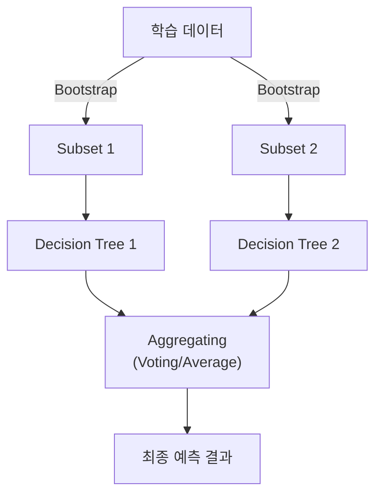

# Ensemble & Random Forest

## I. 집단 지성을 통한 예측력 극대화, Ensemble & Random Forest 개요

**정의**: 여러 개의 약한 학습기( **Weak Learner** )를 결합하여 하나의 강한 학습기를 만드는 기법( **Ensemble** )과, 이를 의사결정나무에 적용한 **Random Forest** 알고리즘  

**특징**:  
( **일반화 성능** ) 개별 모델의 오버피팅 문제를 다수의 모델 결합을 통해 상쇄하여 일반화 성능 향상  
( **다양성 확보** ) 배깅( **Bagging** )과 부스팅( **Boosting** )을 통해 서로 다른 특성을 가진 모델들을 학습  
( **강건성** ) 데이터의 노이즈나 이상치( **Outlier** )에 대해 단일 모델보다 훨씬 강건한( **Robust** ) 예측 수행  

## II. Ensemble의 주요 기법 및 Random Forest 메커니즘

### 가. 앙상블의 3대 핵심 기법

| 기법 | 상세 설명 | 대표 알고리즘 |
| :--- | :--- | :--- |
| **Bagging** | 병렬적으로 여러 모델을 학습시킨 후 결과를 평균/다수결로 통합 | **Random Forest** |
| **Boosting** | 이전 모델의 오차를 보완하며 순차적으로 모델을 학습 | **XGBoost**, **LightGBM**, **CatBoost** |
| **Stacking** | 여러 모델의 예측 결과를 다시 입력값으로 사용하여 최종 모델 학습 | **Meta Learner** |

### 나. Random Forest의 핵심 구성 요소

- **Bootstrapping**: 중복을 허용한 무작위 샘플링을 통해 여러 개의 훈련 세트 생성
- **Feature Randomness**: 노드 분할 시 전체 변수가 아닌 일부 무작위 변수만 검토하여 트리 간 상관관계 감소
- **OOB (Out-of-Bag)**: 샘플링에 포함되지 않은 데이터를 활용하여 별도의 검증 세트 없이 모델 평가 가능

## III. Ensemble 모델의 장단점 및 기술 동향

| 항목 | 상세 내용 |
| :--- | :--- |
| **장점** | 매우 높은 예측 정확도, 변수 중요도( **Feature Importance** ) 제공, 하이퍼파라미터 튜닝 용이 |
| **단점** | 모델이 복잡해져 해석력이 단일 트리보다 낮음( **Black-box** 화 ), 연산 자원 및 시간 증가 |
| **발전 방향** | 현재 정형 데이터( **Tabular Data** ) 분석에서는 **XGBoost**, **LightGBM** 등 부스팅 계열이 표준으로 사용됨 |

**기술 동향**: 딥러닝이 비정형 데이터(이미지, 언어)를 지배하고 있다면, 앙상블 기반의 트리 모델들은 여전히 금융, 커머스 등 수치형 정형 데이터 분야에서 최고의 성능을 보여주고 있음
