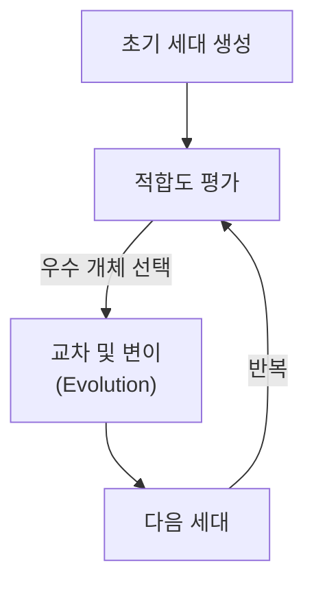
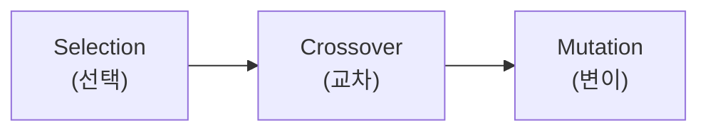

# Genetic Algorithm (유전 알고리즘)

## I. 자연 선택과 진화의 공학적 모델링, Genetic Algorithm 개요

**정의**: 생물의 진화 과정인 자연 선택( **Natural Selection** )과 유전 법칙을 모방하여 최적화 문제의 해를 찾는 확률적 탐색 알고리즘  

**특징**:  
( **전역 탐색** ) 특정 지점의 기울기에 의존하지 않고 전체 해 공간을 무작위적으로 탐색하여 전역 최적해( **Global Optimum** ) 추구  
( **확률적 모델** ) 결정론적 방법이 아닌 확률적 기법을 통해 복잡한 비선형 문제 해결  
( **범용성** ) 목적 함수의 미분 불가능성이나 불연속성에 관계없이 적용 가능  

## II. 유전 알고리즘의 핵심 연산 및 프로세스

### 가. 진화의 주요 3단계 연산

### 나. 알고리즘 구성 요소 및 상세 기능

| 구성 요소 | 상세 설명 | 비고 |
| :--- | :--- | :--- |
| **염색체 (Chromosome)** | 문제의 해를 나타내는 데이터 구조 (주로 이진수나 벡터) | **Individual** |
| **적합도 함수 (Fitness)** | 개체가 최적해에 얼마나 가까운지 평가하는 척도 | **Objective Function** |
| **선택 (Selection)** | 적합도가 높은 개체를 다음 세대의 부모로 선정 (예: 룰렛 휠, 토너먼트) | **Survival of Fittest** |
| **교차 (Crossover)** | 두 부모의 유전 정보를 결합하여 새로운 자손 생성 | **Exploitation** |
| **변이 (Mutation)** | 유전 정보의 일부를 무작위로 변경하여 다양성 유지 및 국소해 탈출 | **Exploration** |

## III. 유전 알고리즘의 활용 및 한계점

| 항목 | 상세 내용 |
| :--- | :--- |
| **주요 활용** | 스케줄링 최적화, 네트워크 경로 설계, 신경망 구조 탐색( **NAS** ), 복잡한 공학 설계 |
| **한계점** | **Fitness** 함수 설계의 난이도, 수렴 속도가 느릴 수 있음, 파라미터(변이율 등) 설정의 민감도 |
| **발전 방향** | 강화학습( **RL** )과 결합하거나, 딥러닝 모델의 하이퍼파라미터 최적화 도구로 널리 사용됨 |

**기술 동향**: 전통적인 최적화 기법을 넘어, 최근에는 대규모 병렬 처리가 가능한 환경에서 신경망의 가중치를 진화적으로 찾는 **Neuroevolution** 연구가 활발히 진행 중임
