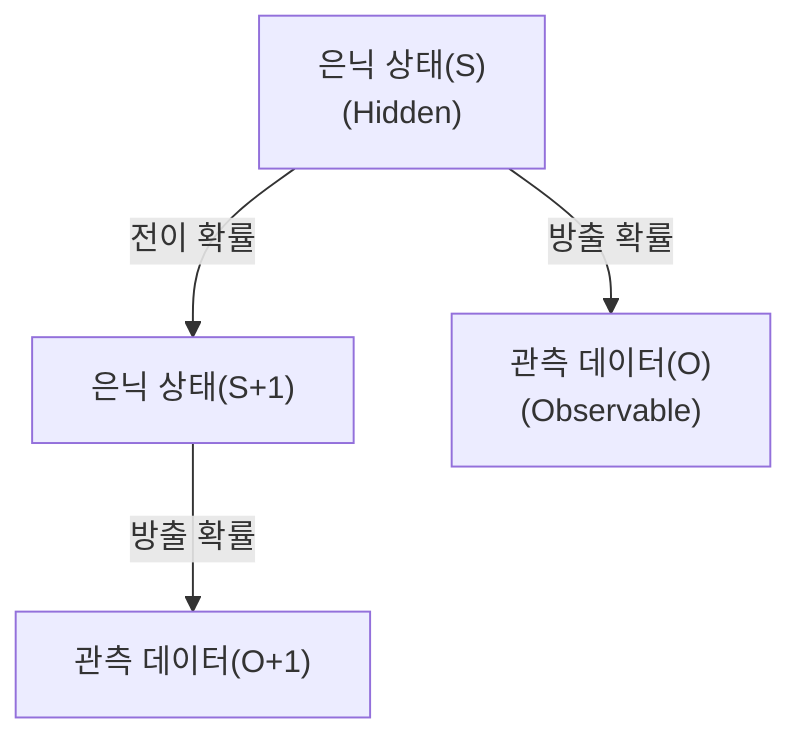

# Hidden Markov Model (HMM)

## I. 관찰 가능한 현상 뒤의 숨겨진 상태, HMM 개요

**정의**: 시스템의 상태를 직접 관찰할 수는 없지만, 관찰 가능한 데이터를 통해 숨겨진 상태( **Hidden State** )의 전이와 확률을 추론하는 통계적 마르코프 모델  

**특징**:  
( **마르코프 성질** ) 미래의 상태가 오직 현재의 상태에 의해서만 결정된다는 무기억성( **Memoryless** ) 가정  
( **이중 확률 과정** ) 상태 간의 전이( **Transition** )와 데이터의 방출( **Emission** )이라는 두 계층의 확률 구조  
( **시계열 특화** ) 음성 인식, 주가 예측 등 시간의 흐름에 따른 패턴 인식 및 시퀀스 데이터 처리에 적합  

## II. HMM의 상세 메커니즘 및 구성 요소

### 가. HMM의 추론 메커니즘

### 나. 핵심 구성 요소 및 3대 알고리즘

| 분류 | 구성 요소 및 알고리즘 | 상세 기능 및 역할 |
| :--- | :--- | :--- |
| **모델 파라미터** | **Initial / Transition / Emission** | 초기 상태 확률, 상태 전이 확률 행렬, 관측치 생성 확률 |
| **평가(Evaluation)** | **Forward / Backward** | 모델 파라미터가 주어졌을 때 특정 시퀀스가 나타날 확률 계산 |
| **디코딩(Decoding)** | **Viterbi Algorithm** | 관측된 시퀀스를 생성했을 가장 가능성 높은 은닉 상태 경로 탐색 |
| **학습(Learning)** | **Baum-Welch (EM)** | 관측 데이터로부터 모델의 파라미터를 최적화하는 반복 학습 |

## III. HMM의 응용 분야 및 기술 동향

### 가. 주요 응용 분야

| 분야 | 활용 사례 | 상세 내용 |
| :--- | :--- | :--- |
| **NLP** | **POS Tagging** | 문장 내 단어의 품사를 문맥에 따라 자동 태깅 |
| **바이오** | **Gene Prediction** | 유전자 염기 서열 내에서 단백질 코딩 영역을 식별 |
| **음성 인식** | **Speech-to-Text** | 입력된 음성 신호로부터 대응되는 단어 시퀀스를 추론 |

### 나. 기술 동향 및 진화

( **Deep Learning Fusion** ) 고전적인 HMM의 통계적 구조와 **RNN/LSTM** 의 강력한 문맥 유지 능력을 결합한 하이브리드 모델이 사용됩니다.  
( **Statistical Robustness** ) 딥러닝에 비해 연산량이 적고 모델 구조의 해석이 명확하여 데이터가 부족한 특정 도메인에서 여전히 선호됩니다.  
