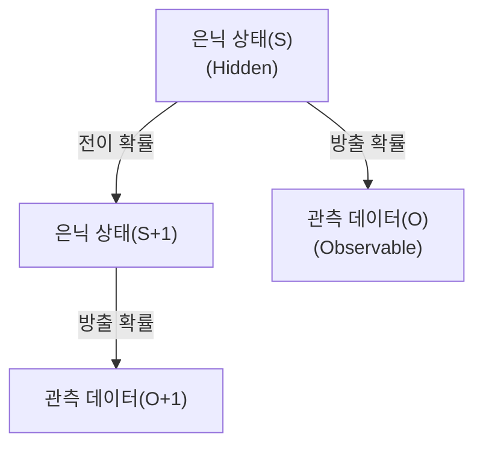

# Hidden Markov Model (HMM)

## I. 관찰 가능한 현상 뒤의 숨겨진 상태, HMM 개요

**정의**: 시스템이 상태를 직접 관찰할 수 없는 '은닉된( **Hidden** )' 마르코프 연쇄로 구성되어 있다고 가정하고, 관찰된 데이터로부터 상태의 전이와 확률을 추론하는 통계 모델  

**특징**:  
( **마르코프 성질** ) 미래의 상태는 오직 현재의 상태에 의해서만 결정된다는 가정 ( **Memoryless** )  
( **이중 확률 과정** ) 상태 전이( **Transition** )와 데이터 관측( **Emission** )이라는 두 가지 확률 과정의 결합  
( **시퀀스 처리** ) 음성, 필기체 인식 등 시간에 따라 변화하는 데이터를 모델링하는 데 특화  

## II. HMM의 3대 핵심 문제와 알고리즘

### 가. HMM의 구성 요소
- **π (Initial)**: 초기 상태 확률
- **A (Transition)**: 상태 간 전이 확률 행렬
- **B (Emission)**: 특정 상태에서 데이터가 관측될 확률

### 나. 주요 문제 해결 방법

| 핵심 문제 | 상세 설명 | 사용 알고리즘 |
| :--- | :--- | :--- |
| **평가 (Evaluation)** | 모델 파라미터가 주어졌을 때 특정 시퀀스가 나타날 확률 계산 | **Forward / Backward** |
| **디코딩 (Decoding)** | 주어진 시퀀스를 생성했을 가장 가능성 높은 은닉 상태 경로 찾기 | **Viterbi Algorithm** |
| **학습 (Learning)** | 관측 데이터로부터 모델 파라미터(A, B)를 최적화 | **Baum-Welch (EM)** |

## III. HMM의 응용 분야 및 한계

| 항목 | 상세 내용 |
| :--- | :--- |
| **주요 응용** | 음성 인식(초기 모델), 단어 품사 태깅( **POS Tagging** ), 유전자 염기 서열 분석 |
| **한계점** | 현재 상태가 직전 상태에만 의존한다는 강한 가정, 긴 시퀀스의 상관관계 파악 어려움 |
| **발전 방향** | 딥러닝과 결합된 **CNN-HMM**, **LSTM-HMM** 등으로 발전하거나 고도화된 딥러닝 모델로 대체 |

**기술 동향**: 딥러닝의 보급으로 많은 분야에서 신경망 모델로 대체되었으나, 데이터의 통계적 구조가 명확한 바이오인포매틱스나 통신 분야에서는 여전히 강력한 도구로 활용됨
