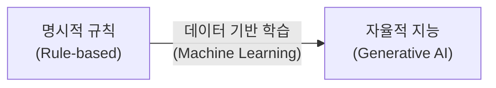
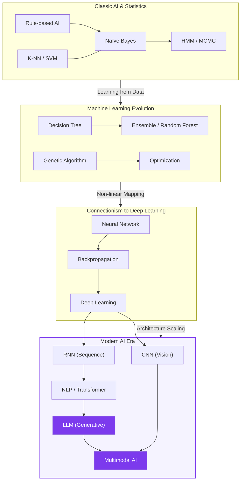

# 개요 및 기술 진화도

## I. 지능의 패러다임 전환, AI 기술 진화 개요

**정의**: 단순한 논리 회로와 규칙에서 시작하여, 데이터로부터 스스로 패턴을 학습하고 인간 수준의 생성 및 추론이 가능한 시스템으로 발전해 온 기술적 여정  

**특징**:  
( **단계적 진화** ) 통계, 기계학습, 딥러닝을 거쳐 거대 언어 모델로의 계층적 발전  
( **범용성 확대** ) 특정 도메인 중심의 성능 최적화에서 모든 산업에 적용 가능한 범용 인공지능( **AGI** ) 지향  

## II. AI 기술의 상세 분류 및 메커니즘

### 가. AI 기술 진화의 메커니즘

### 나. 주요 기술 모델별 역할 및 진화 단계

| 진화 단계 | 주요 기술 모델 | 핵심 기여 및 연관성 |
| :--- | :--- | :--- |
| **1단계**: 규칙 및 통계 | **Rule-based**, **Naïve Bayes**, **HMM** | 인간의 지식을 직접 주입하거나 통계적 확률에 기반하여 명시적 문제를 해결 |
| **2단계**: 특징 기반 학습 | **Decision Tree**, **SVM**, **K-NN** | 데이터로부터 특징( **Feature** )을 추출하고, 기하학적/논리적 경계를 찾아 분류 수행 |
| **3단계**: 신경망과 최적화 | **Neural Network**, **Backpropagation** | 생물학적 뉴런을 모사하고 미분을 통한 오차 역전파로 복잡한 학습 체계 구축 |
| **4단계**: 심층 학습( **DL** ) | **Deep Learning**, **CNN**, **RNN** | 층을 깊게 쌓아 데이터의 고수준 추상화를 자동화(이미지, 시계열 특화) |
| **5단계**: 거대 모델 & 생성 | **NLP**, **LLM**, **Multimodal AI** | 자기지도 학습과 어텐션 기반으로 인간 수준의 언어 이해와 다중 감각 통합 달성 |

## III. 기술 간의 상호 보완 관계 및 트렌드

### 가. 기술 간 상호 작용

1.  **확정적 로직 vs 확률적 로직**: **Rule-based** 시스템의 신뢰성과 **Neural Network**의 유연성을 결합한 **Neuro-symbolic AI**로 발전 중입니다.
2.  **전역 최적화와 지역 최적화**: **Backpropagation**이 놓칠 수 있는 전역 최적해를 찾기 위해 **Genetic Algorithm**이나 **MCMC** 기법이 하이퍼파라미터 최적화 등에 활용됩니다.
3.  **단순 분류에서 복잡한 생성으로**: **SVM**이나 **K-NN**이 정형 데이터의 '분류'에 집중했다면, **Transformer** 기반의 **LLM**은 데이터 간의 '관계'를 학습하여 새로운 콘텐츠를 '생성'하는 단계로 진화했습니다.

---
:::tip[학습 가이드]
왼쪽 사이드바의 리스트는 기초적인 **Rule-based AI**부터 최신 **Multimodal AI**까지 기술의 복잡도와 출현 순서를 고려하여 배치되어 있습니다. 순서대로 학습하시면 AI 기술의 근간과 최신 트렌드를 유기적으로 이해하실 수 있습니다.
:::
