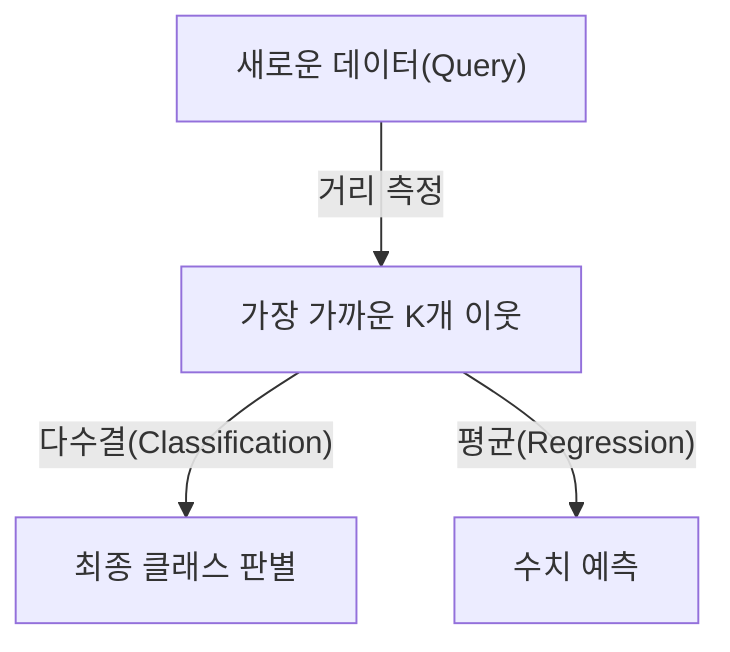

# K-Nearest-Neighbor (K-NN)

## I. 근접 이웃과의 유사성 기반 분류, K-NN 개요

**정의**: 새로운 데이터가 주어졌을 때, 기존 데이터셋에서 가장 가까운 K개의 이웃을 찾아 그들의 속성에 따라 분류하거나 회귀를 수행하는 인스턴스 기반 학습( **Instance-based Learning** ) 알고리즘  

**특징**:  
( **게으른 학습** ) 별도의 훈련 과정 없이 데이터를 저장만 해두었다가 요청 시에 계산하는 **Lazy Learning**  
( **비모수적 모델** ) 데이터의 분포를 가정하지 않아 현실 세계의 다양한 데이터에 유연하게 적용 가능  
( **직관성** ) "유유상종"의 원리를 수치화한 것으로 결과에 대한 해석이 매우 직관적임  

## II. K-NN의 핵심 요소 및 파라미터 결정

### 가. 거리 측정 방식 및 K값의 영향

| 구분 | 상세 내용 | 비고 |
| :--- | :--- | :--- |
| **유클리드 거리** | 두 점 사이의 직선거리를 계산하는 가장 일반적인 방식 | **L2 Distance** |
| **맨해튼 거리** | 각 좌표 차이의 절대값을 합산하는 방식 (격자 구조 유리) | **L1 Distance** |
| **K값 선택** | K가 너무 작으면 과적합( **Overfitting** ), 너무 크면 과소적합( **Underfitting** ) | **Bias-Variance Trade-off** |

### 나. K-NN 알고리즘 프로세스
1. **데이터 저장**: 학습 데이터를 특징 공간에 매핑
2. **거리 계산**: 새로운 데이터와 모든 기존 데이터 간의 거리 측정
3. **이웃 탐색**: 거리가 가장 짧은 상위 K개 데이터 선정
4. **결과 도출**: 분류 시 다수결( **Majority Vote** ), 회귀 시 평균값 계산

## III. K-NN의 장단점 및 최적화 전략

| 항목 | 상세 내용 |
| :--- | :--- |
| **장점** | 알고리즘이 매우 단순함, 다중 클래스 분류가 용이함, 데이터 노이즈에 강건함 |
| **단점** | 데이터가 많아질수록 계산량(거리 측정) 급증, 특징 스케일에 매우 민감함, 차원의 저주 문제 |
| **최적화** | **Standardization** (표준화) 필수, **KD-Tree** / **Ball Tree** 등을 통한 검색 속도 향상 |

**기술 동향**: 고차원 대용량 데이터 환경에서는 정확한 K-NN 대신 속도를 높인 근사 근접 이웃 탐색( **ANN**, **Approximate Nearest Neighbor** ) 기술이 벡터 데이터베이스의 핵심 기술로 활용되고 있음
