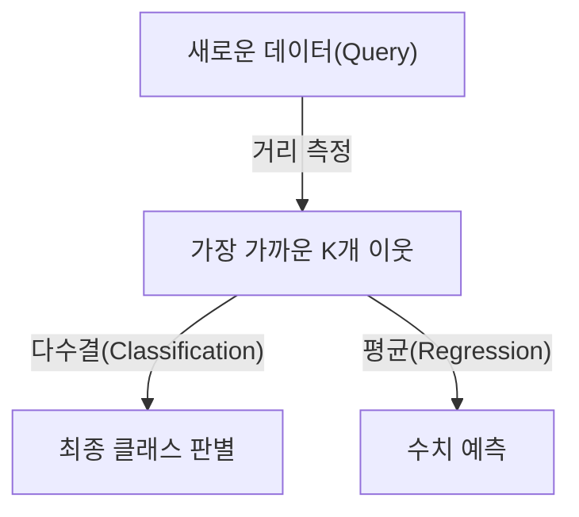

# K-Nearest-Neighbor (K-NN)

## I. 근접 이웃과의 유사성 기반 분류, K-NN 개요

**정의**: 새로운 데이터 포인트와 기존 데이터셋 사이의 거리를 측정하여, 가장 가까운 **K** 개의 이웃 데이터의 레이블에 따라 결과를 분류하거나 예측하는 인스턴스 기반 학습( **Instance-based Learning** ) 알고리즘  

**특징**:  
( **게으른 학습** ) 훈련 데이터에 대한 사전 모델을 생성하지 않고 예측 시점에만 연산을 수행하는 `"**Lazy Learning**"`  
( **비모수 모델** ) 데이터의 특정 분포 형태를 가정하지 않으므로 유연하고 다양한 데이터 구조에 적용 가능  
( **데이터 기반** ) 특징 공간상의 데이터 밀도와 유사도에만 의존하여 결과를 도출하는 직관적 메커니즘  

## II. K-NN의 상세 메커니즘 및 구성 요소

### 가. K-NN의 추론 메커니즘

### 나. 핵심 구성 요소 및 상세 기능

| 구성 요소 | 상세 설명 | 비고 |
| :--- | :--- | :--- |
| **K-Value** | 결과 결정에 참여할 이웃의 수로 모델의 복잡도와 일반화 성능을 결정 | **Bias-Variance** |
| **Distance Metric** | 유클리드, 맨해튼 등 데이터 간의 유사도를 수치화하는 거리 계산 함수 | **L1 / L2 Distance** |
| **Feature Scaling** | 특정 변수의 영향력이 비대해지지 않도록 데이터의 범위를 표준화 | **Normalization** |
| **Voting Mechanism** | 다수결 방식 혹은 거리에 비례한 가중치 부여 방식으로 최종 결과 도출 | **Weighting** |

## III. K-NN의 기술적 과제 및 발전 동향

### 가. 한계점 및 최적화 전략

| 항목 | 상세 내용 | 해결 방안 |
| :--- | :--- | :--- |
| **차원의 저주** | 특징 수(차원)가 많아질수록 데이터 간 거리가 멀어져 변별력 상실 | 차원 축소( **PCA** ) 적용 |
| **연산 복잡도** | 모든 학습 데이터와의 거리를 계산해야 하므로 대용량 데이터에서 지연 발생 | **KD-Tree**, **Ball-Tree** |
| **이상치 민감도** | 적절하지 않은 **K** 값 설정 시 노이즈나 이상치에 의해 결과 왜곡 | 교차 검증을 통한 **K** 최적화 |

### 나. 기술 동향

( **Vector Database** ) 대규모 임베딩 데이터에서 유사한 데이터를 빠르게 찾는 `"**Vector Search**"` 의 근간 기술로 다시 주목받고 있습니다.  
( **ANN** ) 연산 효율성을 극대화하기 위해 정확한 이웃 대신 근사치를 찾는 근사 근접 이웃( **Approximate Nearest Neighbor** ) 기술로 발전하고 있습니다.  
