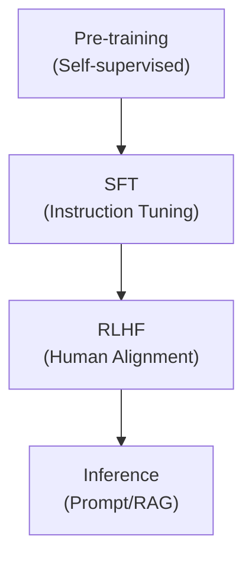

# Large Language Model (LLM)

## I. 거대 파라미터와 창발적 지능, LLM 개요

**정의**: 수천억 개 이상의 파라미터( **Parameters** )를 가진 거대 신경망을 대규모 데이터로 학습시켜, 자연어 이해 및 생성 능력을 극대화한 인공지능 모델  

**특징**:  
( **창발성** ) 일정 규모 이상의 크기에서 특정 능력이 갑자기 나타나는 **Emergent Abilities** 현상 발생  
( **범용성** ) 별도의 미세 조정 없이도 지시어( **Prompt** )만으로 다양한 작업 수행 가능  
( **지식 압축** ) 인류가 축적한 방대한 텍스트 정보를 가중치 형태로 압축하여 보유  

## II. LLM의 핵심 아키텍처 및 학습 프로세스

### 가. LLM의 생명 주기: Pre-training에서 Alignment까지

### 나. 핵심 기술 요소

| 기술 요소 | 상세 설명 | 비고 |
| :--- | :--- | :--- |
| **Transformer** | 멀티 헤드 어텐션 기반의 병렬 처리 아키텍처 | **Backbone** |
| **Tokenization** | 텍스트를 모델이 처리 가능한 최소 단위로 분할 (예: **BPE**) | **Preprocessing** |
| **Attention** | 문장 내 단어 간 관계의 중요도를 계산하는 메커니즘 | **Self-Attention** |
| **Scaling Law** | 데이터, 컴퓨팅, 파라미터 크기에 비례하여 성능이 향상되는 법칙 | **Model Size** |

## III. LLM의 한계 및 주요 해결 전략

| 한계점 | 상세 내용 | 해결 전략 |
| :--- | :--- | :--- |
| **환각 현상** | 사실이 아닌 내용을 그럴듯하게 답변 ( **Hallucination** ) | **RAG**, **Fact**-**checking** |
| **최신성 부족** | 학습 데이터 차단 시점 이후의 정보 부재 | **Search Engine Link**, **Web Browsing** |
| **비용 및 자원** | 학습과 추론에 막대한 컴퓨팅 자원 및 비용 발생 | **Quantization**, **Distillation**, **sLLM** |

**기술 동향**: 현재 LLM은 텍스트를 넘어 이미지, 오디오를 동시에 처리하는 멀티모달( **Multimodal** )로 확장 중이며, 특정 도메인에 특화된 소형 거대 언어 모델( **sLLM** ) 시장도 급성장하고 있음
