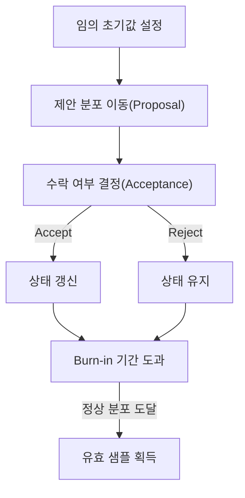

# Markov Chain Monte Carlo (MCMC)

## I. 확률 분포의 샘플링과 상태 전이, MCMC 개요

**정의**: 직접 샘플링하기 어려운 복잡한 목표 확률 분포로부터, 마르코프 연쇄( **Markov Chain** )의 정상 분포를 이용하여 수치적으로 샘플을 추출하는 알고리즘  

**특징**:  
( **몬테카를로** ) 무작위 난수를 발생시켜 수치적 근사해를 구하는 확률적 방법론의 결합  
( **무기억성** ) 다음 샘플의 생성이 오직 현재 샘플의 상태에 의해서만 결정되는 연쇄적 구조  
( **고차원 처리** ) 적분이 불가능한 복잡한 다변량 분포나 사후 확률 분포 추정에 탁월한 성능 발휘  

## II. MCMC의 상세 메커니즘 및 구성 요소

### 가. MCMC의 샘플링 메커니즘

### 나. 주요 알고리즘 및 상세 기능

| 알고리즘 종류 | 상세 설명 | 비고 |
| :--- | :--- | :--- |
| **Metropolis-Hastings** | 후보 상태를 제안하고 목표 분포와의 확률 비율로 이동 여부 결정 | 가장 범용적인 샘플링 기법 |
| **Gibbs Sampling** | 다변수 분포에서 각 변수를 다른 변수들의 조건부 확률에 따라 순차 샘플링 | 다차원 분포 처리에 효율적 |
| **Hamiltonian MC** | 물리학의 해밀토니안 역학을 도입하여 샘플링 경로의 탐색 효율 극대화 | 고차원 수렴 속도 대폭 향상 |

## III. MCMC의 기술적 요소 및 동향

### 가. 핵심 기술적 고려사항

| 핵심 요소 | 상세 내용 | 비고 |
| :--- | :--- | :--- |
| **Burn-in** | 초기값의 편향을 제거하기 위해 수렴 전 생성된 초기 샘플들을 폐기 | **Initial Bias Removal** |
| **Mixing Rate** | 샘플링 알고리즘이 목표 분포 공간을 얼마나 빠르고 고르게 탐색하는가 | **Convergence Speed** |
| **Autocorrelation** | 인접한 샘플 간의 상관관계 정도를 나타내며 독립적 샘플 확보의 지표 | **Sample Independence** |

### 나. 기술 동향

( **Scalable MCMC** ) 대규모 데이터 처리를 위해 확률적 경사 하강법과 결합된 **SGLD** (Stochastic Gradient Langevin Dynamics) 기법이 활용됩니다.  
( **Probabilistic Programming** ) **Stan**, **PyMC** 등 확률적 프로그래밍 언어를 통해 복잡한 베이지안 모델의 자동 샘플링 도구로 대중화되었습니다.  
