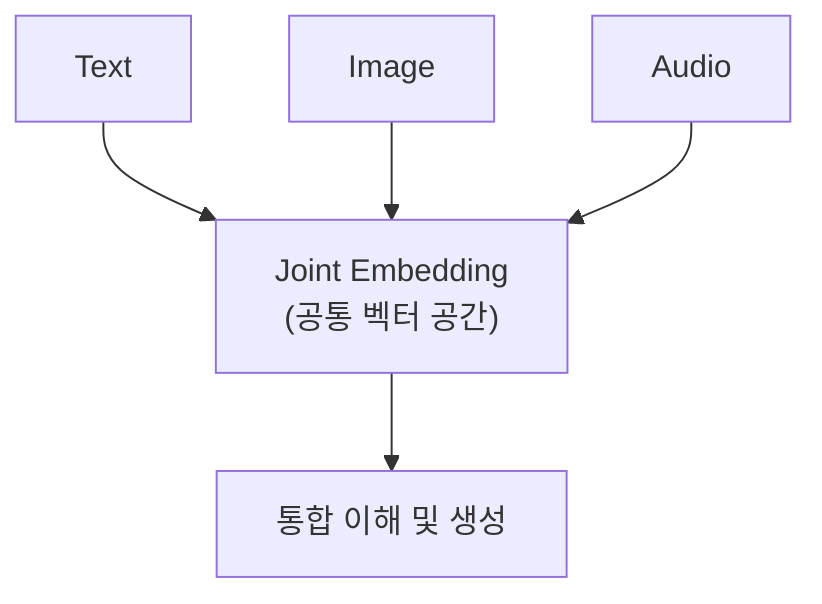
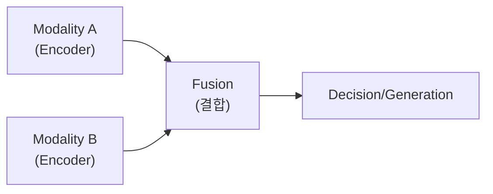

# Multimodal AI

## I. 감각의 통합과 다중 모달리티, Multimodal AI 개요

**정의**: 텍스트, 이미지, 오디오, 비디오 등 서로 다른 유형의 데이터( **Modality** )를 동시에 입력받아 관계를 파악하고 결과물을 생성하는 인공지능 기술  

**특징**:  
( **상호 참조** ) 이미지의 내용을 텍스트로 설명하거나, 텍스트로 이미지를 생성하는 등 모달 간 지식 전이 수행  
( **인간 유사성** ) 시각, 청각, 언어 능력을 결합하여 인간과 유사한 인지 능력 구현  
( **공통 임베딩** ) 서로 다른 종류의 데이터를 하나의 공통된 수치 공간( **Joint Vector Space** )에 매핑  

## II. Multimodal AI의 학습 기법 및 아키텍처

### 가. 모달리티 통합 방식

### 나. 주요 기술 및 모델

| 구분 | 주요 모델/기술 | 상세 설명 |
| :--- | :--- | :--- |
| **대조 학습** | **CLIP** | 이미지와 텍스트 쌍을 대조하여 유사한 의미를 가깝게 학습 |
| **생성 모델** | **Stable Diffusion**, **DALL-E** | 텍스트 조건부 이미지 생성 ( **Text-to-Image** ) |
| **멀티모달 LLM** | **GPT-4o**, **Claude 3.5**, **Gemini** | 이미지 이해와 텍스트 추론이 통합된 거대 모델 |
| **비디오 생성** | **Sora** | 시공간적 일관성을 유지하며 영상 생성 |

## III. Multimodal AI의 활용 및 발전 방향

| 항목 | 상세 내용 |
| :--- | :--- |
| **주요 응용** | 자율주행(센서+맵), 의료 진단(영상+차트), 시각 장애인 보조, 콘텐츠 생성 |
| **핵심 과제** | 모달 간의 불균형 처리, 막대한 컴퓨팅 연산량, 데이터 정렬( **Alignment** ) 난이도 |
| **미래 전망** | 로보틱스와 결합하여 물리적 환경을 이해하고 상호작용하는 **Embodied AI**로 진화 |

**기술 동향**: 최근 AI 모델은 처음부터 여러 모달리티를 동시에 학습하는 네이티브 멀티모달( **Native Multimodal** ) 방식으로 설계되어, 더욱 정교한 상황 인지 능력을 보여주고 있음
