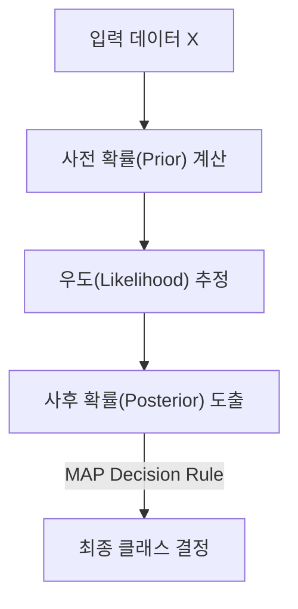

# Naïve Bayes

## I. 조건부 확률 기반의 독립성 가정, Naïve Bayes 개요

**정의**: 베이즈 정리( **Bayes' Theorem** )를 적용하여 모든 특징( **Feature** )이 서로 독립이라는 나이브(순진한) 가정하에 데이터를 분류하는 확률 모델  

**특징**:  
( **단순성** ) 계산 복잡도가 매우 낮아 대규모 데이터셋에서도 빠른 학습과 예측 가능  
( **독립성 가정** ) 특징 간의 상관관계를 무시함으로써 고차원 데이터에서도 성능 유지  
( **소량 데이터** ) 적은 학습 데이터로도 비교적 준수한 성능을 보이며 실시간 시스템에 적합  

## II. Naïve Bayes의 상세 메커니즘 및 구성 요소

### 가. Naïve Bayes의 메커니즘

### 나. 주요 확률 분포 모델 및 상세 기능

| 모델 종류 | 상세 설명 | 주요 용도 |
| :--- | :--- | :--- |
| **Multinomial NB** | 각 단어의 출현 빈도수를 기반으로 확률 계산 | 텍스트 분류, 스팸 메일 필터링 |
| **Bernoulli NB** | 특징의 존재 여부( **0/1** )만을 이진 변수로 판단 | 짧은 문서의 감성 분석 및 이진 분류 |
| **Gaussian NB** | 특징이 연속형이며 정규 분포를 따른다고 가정 | 수치 데이터 기반의 센서 데이터 분류 |

## III. Naïve Bayes의 장단점 및 기술 동향

### 가. 핵심 장점과 한계점

| 항목 | 상세 내용 | 비고 |
| :--- | :--- | :--- |
| **장점** | 학습 속도가 압도적이며 고차원 데이터 처리에 효율적임 | **High Efficiency** |
| **한계점** | 변수 간 독립성 가정이 깨질 경우 모델의 신뢰도 저하 | **Zero Frequency Issue** |
| **극복 방안** | **Laplace Smoothing** 기법을 적용하여 확률값 **0** 발생 방지 | **Smoothing** |

### 나. 기술 동향

( **Baseline Model** ) 압도적인 속도와 가성비 덕분에 여전히 대용량 텍스트 분류 시스템의 베이스라인 모델로 널리 활용되고 있습니다.  
( **Hybrid Approach** ) 딥러닝 모델의 초기 필터링이나 앙상블 모델의 하위 구성 요소로 결합되어 처리 비용을 절감하는 용도로 쓰입니다.  
